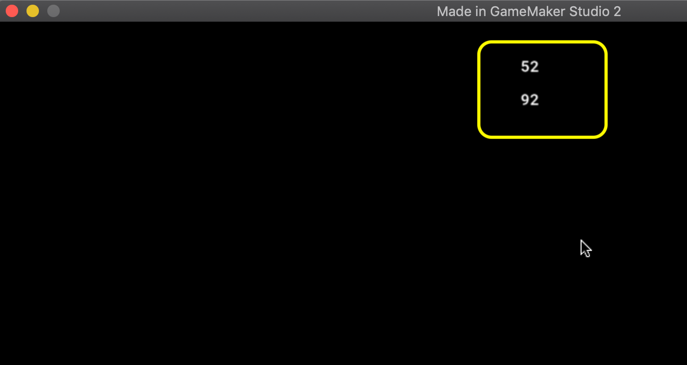

### GMS2 Data Types

<sub>[previous](../spositioning-text/README.md#user-content-gms2-positioning-text) • [home](../README.md#user-content-gamemaker-studio-2-getting-started) • [next](../variables/README.md#user-content-gms2-variables)</sub>


This tutorial is intended for those wanting an introduction to <i>GameMaker Studio 2</i> using their scrpting language <i>GML</i>. This assumes no prior knowledge of the software or scripting. This walk through looks at [data types](https://manual.yoyogames.com/GameMaker_Language/GML_Overview/Data_Types.htm) in GMS2. Lets looks at the most common built in data types that **GameMaker GML** provides us.  A data type indicates what kind of information a variable holds and how to allocate memory to store it.

* Tested on GameMake Studio2.3.5.589
* An existing [GML Project](https://github.com/maubanel/GMS2-Snippets/blob/main/rename-project/README.md#user-content-rename-gms2-project)

<br>

---

##### `Step 1.`\|`ITB`|:small_blue_diamond:

Lets create a new **room** and look at some more data types.  *Right click* on the **Rooms** title in the **Asset Browser** menu.  *Select* **Create | Room** then change the name to `rm_data_types`.  Open up the **Room Order** item and *drag* **rm_data_types** to the first room in the list.  This is important as **GameMaker** *loads* the first room in this list.  We now want to load this new room (if we have more than one room in our project)!


##### `Step 2.`\|`FHIU`|:small_blue_diamond: :small_blue_diamond: 

Lets now create another object that will be responsible for controlling all elements unique to this level.  *Right click* on **Object** in the **Asset Browser** menu, then select **Create | Object** and call it `obj_data_types_controller`.


##### `Step 3.`\|`ITB`|:small_blue_diamond: :small_blue_diamond: :small_blue_diamond:

Now in this newly created object  *left click* on the <kbd>Add Event</kbd> button and add a **Draw | Draw** event.


##### `Step 4.`\|`ITB`|:small_blue_diamond: :small_blue_diamond: :small_blue_diamond: :small_blue_diamond:

Now lets take a look at the newly created script.  The first line is special and has unique section that has `/// @description` .  This tells the **IDE** that this is the *title* of this script and what follows it shows up in the **Events** list window. *Properly* naming this makes it easier to find code that you wrote previously. 


##### `Step 5.`\|`ITB`| :small_orange_diamond:

Now lets go to this newly created draw event and update the **description** and the first line of help to demonstrate what we will do next.  *Type* the below message and press <kbd>Save</kbd> and see that what follows `/// @description` now shows up in the **Events** window:


##### `Step 6.`\|`ITB`| :small_orange_diamond: :small_blue_diamond:

> "Real numbers are any value that is not a string, nor any of the other possible data types. So, 124, 45639.566546456, 0, -45.5 etc... are all examples of real numbers. All real numbers are stored as double-precision floating point values (even seemingly integer values), so you may experience slight rounding errors when dealing with these." - GameMaker Manual

In **obj_data_types_controller** *press* the <kbd>Variable Definitions</kbd> button. Add a variable named `age` and set the **value** to any random whole number representing a fictional age.  Leave it as type `Real`.  *Add* another variable named `line_height` and set the **Value** to `32`.  We will use this to space each line by **32** pixels.  *Leave* this as a `Real` number.


##### `Step 7.`\|`ITB`| :small_orange_diamond: :small_blue_diamond: :small_blue_diamond:

Drag an instance of **obj_data_types_controller** to the edge of the new **rm_data_types** room.  You can put it on the outside of the room as it is just there to run code, we will not use its position on screen.


##### `Step 8.`\|`ITB`| :small_orange_diamond: :small_blue_diamond: :small_blue_diamond: :small_blue_diamond:

Go to the **obj_data_types_controller | Draw** event script window.  Start by *aligning* the text to the horizontal center.  Then draw the text and don't use the built in x and y variables. Since we placed it off screen we will position the text where we want it.  We will use **room_width** times **0.5** (same as dividing the room_width variable by half).  We set the **y** value at our current **line_height** variable.  Then we reset the horizontal alignment to its default. Type the following into your draw script to perform the above.


##### `Step 9.`\|`ITB`| :small_orange_diamond: :small_blue_diamond: :small_blue_diamond: :small_blue_diamond: :small_blue_diamond:

Make sure that in **Room Order** that  **rm_data_types** on top. This way it will run this room first. Then run the game by pressing the <kbd>Play</kbd> button in the top menu bar to launch the game.  You should see the age you entered printed in the top center of the screen:


##### `Step 10.`\|`ITB`| :large_blue_diamond:

Now we can do other things with real numbers, we can perform mathematical operations on them.  So we can evaluate: 52 + 20 * 2.  Remember the order of operations, as this will evaluate as *52 + (20 * 2)*.  So lets make this change and add a second line to our on screen text.  We advance the **Y** value by *multiplying* **line_height** by `2`.  This will move it down one line.  We will also not use the real number `52`, we will use the variable **age**. *Add* another comment to the line.


##### `Step 11.`\|`ITB`| :large_blue_diamond: :small_blue_diamond: 

Now run the game by pressing the <kbd>Play</kbd> Button in the top menu bar to launch the game.  You should see the second line that clearly state 92.  This means that the order of operations behaved as we expected.




##### `Step 12.`\|`ITB`| :large_blue_diamond: :small_blue_diamond: :small_blue_diamond: 

Lets clean up a few things.  The spacing is a bit too big for the font that is default on my computer.  Go to the **Variable Definitions** tab and change the **Value | line_height** to `22`.


##### `Step 13.`\|`ITB`| :large_blue_diamond: :small_blue_diamond: :small_blue_diamond:  :small_blue_diamond: 

Go back to the **Draw** event script and put brackets around the multiplication.  Even though this makes no difference, it will help you or others to better understand what you mean.  There is no downside to being more explicit, the compiler will generate the same end result.  It is just a clearer expression of your intent.


##### `Step 14.`\|`ITB`| :large_blue_diamond: :small_blue_diamond: :small_blue_diamond: :small_blue_diamond:  :small_blue_diamond: 

Now run the game by pressing the <kbd>Play</kbd> Button in the top menu bar to launch the game.  You should see a tighter spacing that looks a bit better.  Notice that the answer is still 91 so the brackets did not change anything in the execution.


##### `Step 15.`\|`ITB`| :large_blue_diamond: :small_orange_diamond: 

The final data type we will look at for now is called a **Boolean**.  A boolean resolves to either 1 (true) or 0 (false). It is preferable to use the words true  and false when refering intead of 0 and 1.  But if you print a boolean value we will only see the number.  

In **GameMaker** any real number above .5 will resolve to true and any number less will be false.  Now we can't select a boolean type we need to cast a real number to a boolean.  We do this by typing (bool)real_number_to_convert.  So lets add two more lines and print the boolean result of 3 and -300.


##### `Step 16.`\|`ITB`| :large_blue_diamond: :small_orange_diamond:   :small_blue_diamond: 

Now run the game by pressing the <kbd>Play</kbd> Button in the top menu bar to launch the game.  You should see a tighter spacing that looks a bit better.  Did you see what you expected. According to the above rules the 3 resolved to true and the -300 resolved to false.


##### `Step 17.`\|`ITB`| :large_blue_diamond: :small_orange_diamond: :small_blue_diamond: :small_blue_diamond:

Previously we were able to add two real numbers together to perform a mathematical operation.  We can also combine strings together.  Instead of a mathematical operation it performs a concatonation.  It puts both strings together as a longer string.

Lets add a fifth line to the printing and concatonate some strings.  Lets *add* two more **Variable Definitions | Variables** to the `obj_data_types_controller`.  We will add a **Name** `first_name` and `last_name` making them both `String` **Type**. I added a **Default** of `Bob` for first name and `Smith` for last name.


##### `Step 18.`\|`ITB`| :large_blue_diamond: :small_orange_diamond: :small_blue_diamond: :small_blue_diamond: :small_blue_diamond:

Now lets string a sentence together.  We can *concatonate* string varialbes with strings. We also need spaces between words.  So we can *add* `"Hello " + first_name + " " + last_name + "!"` as a fifth line.  *Add* the following 5th text string to our **Draw** script:


##### `Step 19.`\|`ITB`| :large_blue_diamond: :small_orange_diamond: :small_blue_diamond: :small_blue_diamond: :small_blue_diamond: :small_blue_diamond:

Now run the game by pressing the <kbd>Play</kbd> Button in the top menu bar to launch the game.  You should see an entire sentence print on the fifth line as it combines all the strings together.


##### `Step 20.`\|`ITB`| :large_blue_diamond: :large_blue_diamond:

So a real number + a real number will perform an addition.  A string + a string will perform a concatonation.  What if we add a string to a real number together.  Lets give it a try. Go back to the first line we printed and add the string and real number "I am " + age + " years old."


##### `Step 21.`\|`ITB`| :large_blue_diamond: :large_blue_diamond: :small_blue_diamond:

Now run the game by pressing the <kbd>Play</kbd> Button in the top menu bar to launch the game.  Woops we now get our first run time error.  What does this mean?  This means it compiles succesfully but when that line is run in game (it is run right away) it asserts to an error. The error tells us which script it is in and the event type (Draw Event obj_data_types_controller).  The error message "DoAdd" isn't very helpful.  Essentially GameMaker can't handle adding a String and a Real number together.  But there is a solution.


##### `Step 22.`\|`ITB`| :large_blue_diamond: :large_blue_diamond: :small_blue_diamond: :small_blue_diamond:

Just as we cast a real number to a boolean we can cast a **Real Number** to a **String**.  What casting does is changes from one data type to another.  There is a function called `string()` in which it casts the value to a string data type. *Edit* the script and pass the **age** real number variable as an argument to the `string()` function.


##### `Step 23.`\|`ITB`| :large_blue_diamond: :large_blue_diamond: :small_blue_diamond: :small_blue_diamond: :small_blue_diamond:

Now run the game by pressing the <kbd>Play</kbd> Button in the top menu bar to launch the game. It works fine as we are back to concatonating multiple strings together because of the cast.


##### `Step 24.`\|`ITB`| :large_blue_diamond: :large_blue_diamond: :small_blue_diamond: :small_blue_diamond: :small_blue_diamond: :small_blue_diamond:

Now inside the cast we can still perform arithmetic operations on the real numbers and it will perform this before casting it to a string.  On the second line surround the mathematical operation with a string(age + (20 * 2)) like so:
	
```
//Performs mathematical operation on second line<br>
draw_text(room_width * .5, line_height * 2, "In 40 years I will be " + string(age + (20 * 2)) + "." );
```


##### `Step 25.`\|`ITB`| :large_blue_diamond: :large_blue_diamond: :small_orange_diamond: 

Now run the game by pressing the <kbd>Play</kbd> Button in the top menu bar to launch the game. Now it concatonates the two strings but only after it has performed the arithmetic operations:


##### `Step 26.`\|`ITB`| :large_blue_diamond: :large_blue_diamond: :small_orange_diamond: :small_blue_diamond:

Even cooler is that we can nest casts.  So we can cast the (bool)real_number to a string.  Lets make a sentence out of our boolean comparisons and double cast:

```
"3 in boolean resolves to: " + string(bool(3))
"-300 in boolean resolves to: " +  string(bool(-300)) 
```


##### `Step 27.`\|`ITB`| :large_blue_diamond: :large_blue_diamond: :small_orange_diamond: :small_blue_diamond: :small_blue_diamond:

Now run the game by pressing the <kbd>Play</kbd> Button in the top menu bar to launch the game. All the lines are now concatonating strings that are cast from either booleans or real numbers.


___


<!--  -->


| [previous](../positioning-text/README.md#user-content-gms2-positioning-text)| [home](../README.md#user-content-gamemaker-studio-2-getting-started) | [next](../variables/README.md#user-content-gms2-variables)|
|---|---|---|
