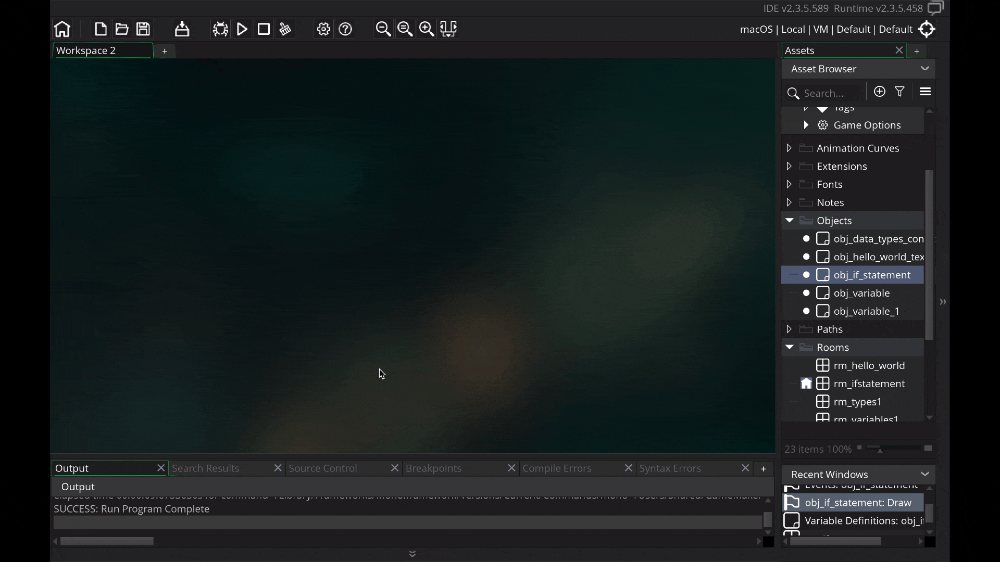
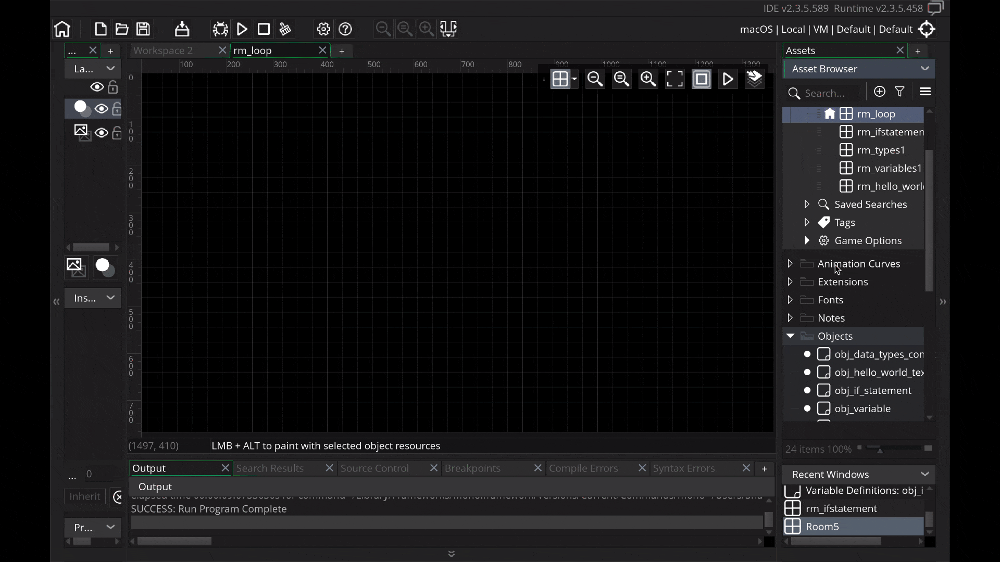
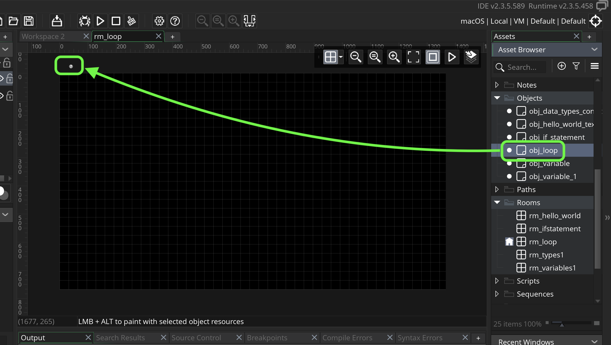
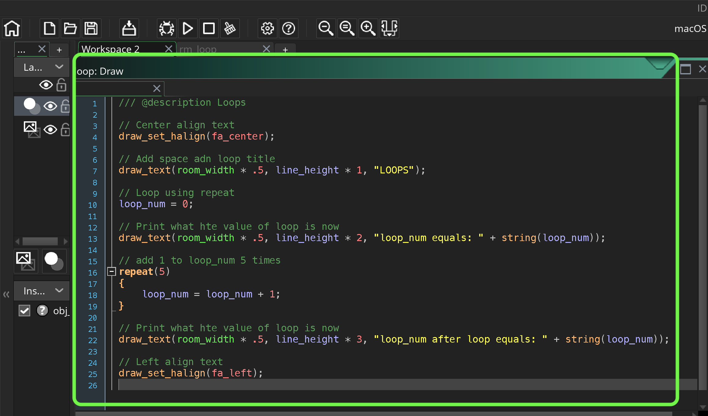
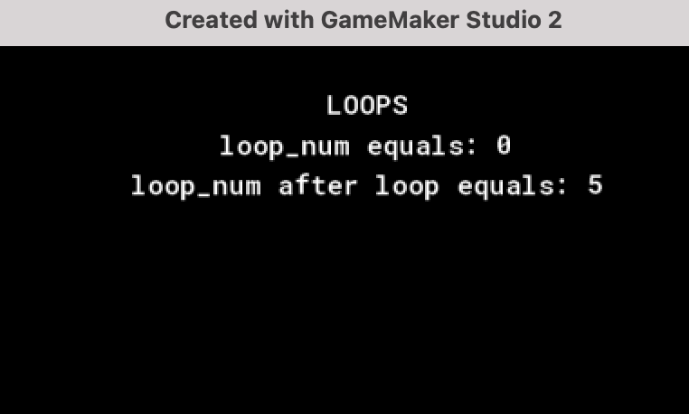
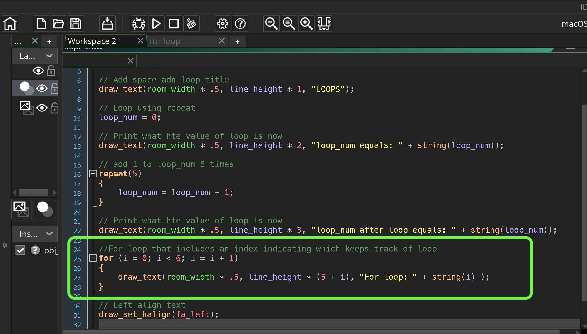
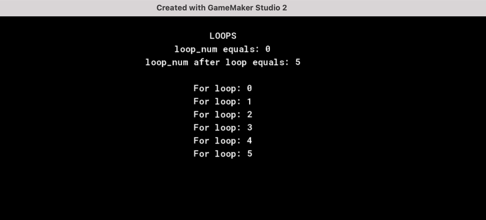
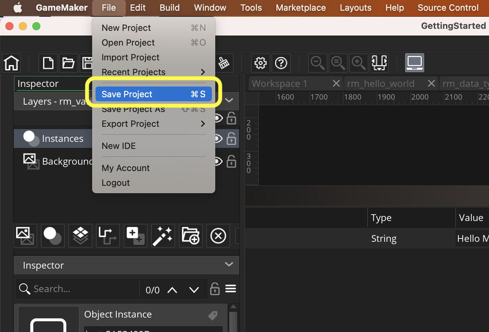

### GMS2 Loops

[previous](../if-statements/README.md#user-content-gms2-if-statements) • [home](../README.md#user-content-gamemaker-studio-2-getting-started) • [next](../positioning-text-1/README.md#user-content-screen-positioning-i)

This tutorial is intended for those wanting an introduction to <i>GameMaker Studio 2</i> using their scrpting language <i>GML</i>. This assumes no prior knowledge of the software or scripting. This walk through looks at [loops](https://manual.yoyogames.com/GameMaker_Language/GML_Overview/Language_Features/for.htm) in GMS2. This is a fundamental feature of most programming languages and it allows us to run an statement multiple times.

A loop repeats itself a given number of times within one frame to perform a set of operations.  In a game we might be looping through all enemies to see which is closest to the player to auto aim a reticule.

 

---

##### `Step 1.`\|`GMGS`|:small_blue_diamond:

Create a new room by *left clicking* on **Rooms** arrow in the **Asset Browser** to open up the rooms list.  *Right click* and select **Rename** and call it `rm_loop`. Go to **Room Order** and move it to the top of the list if you have other rooms in this project.

##### `Step 2.`\|`GMGS`|:small_blue_diamond: :small_blue_diamond: 

Right click on **Objects** in the **Asset Browser** and select **Create | Object**.  Call this object `obj_loop`.  Press the **Events | Add Events | Draw | Draw** to add a draw event. Add a **Variable Definition** and createa a new **Variable** called `line_height` and leave it as a real number and set the default to `22`.

##### `Step 3.`\|`GMGS`|:small_blue_diamond: :small_blue_diamond: :small_blue_diamond:

Now drag an instance of **obj_loop** into the room **rm_loop**

##### `Step 5.`\|`GMGS`| :small_orange_diamond:

We will look at two loops supported in GameMaker.  The first is **[repeat](https://manual.yoyogames.com/GameMaker_Language/GML_Overview/Language_Features/repeat.htm)**.

So lets look at programming a loop to see what it does. Lets create a list of what we want to do in this next portion of our script:

* Center align text
* Add a title
* Add a variable called loop_num
* Print value of loop_num under title
* Add a `repeat(5)` loop which runs what is inside the following curly braces five times
* Add 1 each time the loop runs to the loop_num variable
* Print value of loop_num after it runs through the loop
* Reset text alignmnet

##### `Step 6.`\|`GMGS`| :small_orange_diamond: :small_blue_diamond:

Now *press* the <kbd>Play</kbd> button in the top menu bar to launch the game. Notice that all the items in our list are addressed. Most importantly we can see that loop_num goes from 0 to 5 proving that the loop ran 5 times.

##### `Step 7.`\|`GMGS`| :small_orange_diamond: :small_blue_diamond: :small_blue_diamond:

Sometimes we need to access a value of where in the loop we are at.  Other times we sometimes don't know how many times we need to loop (go through each enemy still alive in level). There is another type of loop that you can use called a **[for loop](https://manual.yoyogames.com/GameMaker_Language/GML_Overview/Language_Features/for.htm)**.  A for loop looks a bit more complicated:

* Starts with an initial value (often starts at 0 but doesn't have to)
* Condition that when it is still true will keep looping (exit condition)
* Do this after a pass through the loop 

These three items are separated by a ; (semi-colon). 

##### `Step 8.`\|`GMGS`| :small_orange_diamond: :small_blue_diamond: :small_blue_diamond: :small_blue_diamond:

These above creates a new **variable** called `i`.  It exits the loop when `i` gets to `6` or above.  After each time through the loop `i` is incremented by `1`. We use the index value `i` to add spacing to the text as we will be adding 5 lines.

Now *press* the <kbd>Play</kbd> button in the top menu bar to launch the game. We should see 5 lines printing the value of the index i.

##### `Step 9.`\|`GMGS`| :small_orange_diamond: :small_blue_diamond: :small_blue_diamond: :small_blue_diamond: :small_blue_diamond:

Select the **File | Save Project** with the latest changes.

___

<!--  -->

| [previous](../if-statements/README.md#user-content-gms2-if-statements)| [home](../README.md#user-content-gamemaker-studio-2-getting-started) | [next](../positioning-text-1/README.md#user-content-screen-positioning-i)|
|---|---|---|