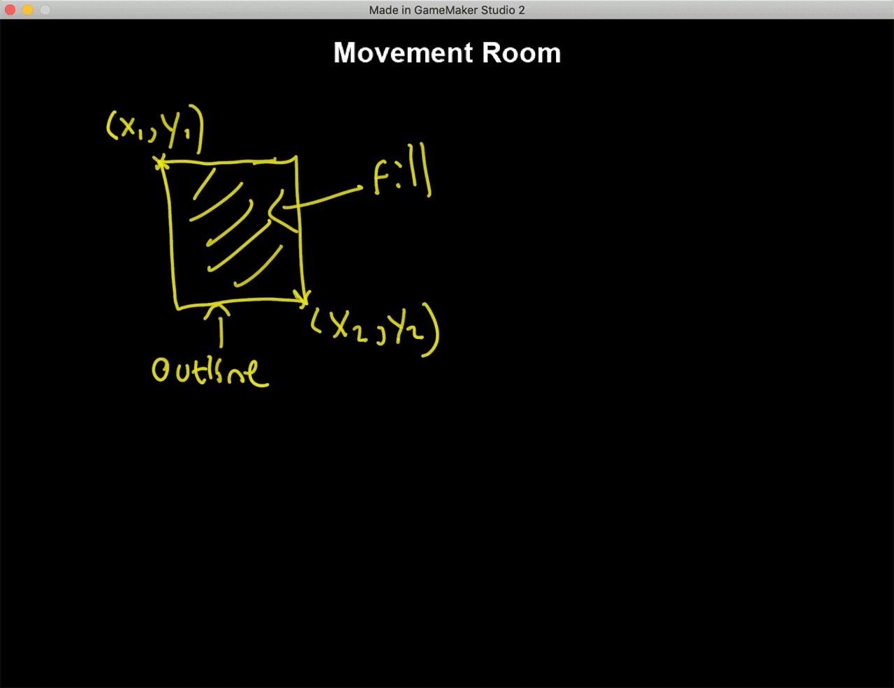

### Simple Movement

<sub>[home](../README.md#user-content-gms2-npc-movement) • [next](../)</sub>


Lets move a non playable character in the most basic way possible using GML.

<br>

---


##### `Step 1.`\|`NPCM`|:small_blue_diamond:

Now what is an NPC?  It is a <i>Non Playable Character</i> in game that moves through logic and a script and not by the controlle, mouse or keyboard.  Lets start by right clicking on **Rooms** and selecting **Create | Room** and call this room `rm_npc_movement`. *Move* it to the top of the list in **Room Order**.   


##### `Step 2.`\|`FHIU`|:small_blue_diamond: :small_blue_diamond: 

Right click on **Objects** in the Resources menu and select **Create | Object**.  Call this new object `obj_movement_controller`. Left click on the <kbd>Add Event</kbd> button and select a **Draw | Draw** event.


##### `Step 3.`\|`NPCM`|:small_blue_diamond: :small_blue_diamond: :small_blue_diamond:

Now lets create two boxes that the square will start and end at. We have a new function to look at: `draw_rectangle(x1, y1, x2, y2, outline)`. In this case x1,y1 are the top left corner in room pixels and x2, y2 are the bottom right.  **Outline** if `true` means there is only an outline and if `false` it will be filled in. We will just need the outline so we will make it false.




##### `Step 4.`\|`NPCM`|:small_blue_diamond: :small_blue_diamond: :small_blue_diamond: :small_blue_diamond:

Copy and paste the following into the **Draw Event** in **obj_movement_controller**.  This will draw a title and make two different colored boxes on the top left and bottom right of hte screen.

```gml
/// @description Draw Title and Target

// Center text alignment
draw_set_halign(fa_center);

// Set the color to yellow
draw_set_color(c_yellow);

// Draw start rectangle
draw_rectangle(44, 44, 148, 148, true);

// Set color to green
draw_set_color(c_green);

// Draw target rectangle
draw_rectangle(1176, 620, 1280, 724, true);

// set color for title font
draw_set_color(c_white);

// Titel top center of hte room
draw_text(room_width * .5, 20, "Movement Room");

// Reset draw color
draw_set_color(c_white);

// Reset alignment
draw_set_halign(fa_left);

```


##### `Step 5.`\|`NPCM`| :small_orange_diamond:

Open up **rm_npc_movement** and drag a copy of **obj_movement_controller** into the scene.


##### `Step 6.`\|`NPCM`| :small_orange_diamond: :small_blue_diamond:

Now *press* the <kbd>Play</kbd> button in the top menu bar to launch the game. You will see a yellow box that the NPC will start in and a green box for it to trabvel to.


##### `Step 7.`\|`NPCM`| :small_orange_diamond: :small_blue_diamond: :small_blue_diamond:

Right click on **Objects** and select **Create | Object**, call the file `obj_npc`.  Right click on **Sprites** and click on **Create | Sprite** and call it `spr_npc`. Press the <kbd>Edit Image</kbd> button and select the **Yellow** color and the **Fill Tool**. Click in the sprite to fill it to a yellow square.  Go back to **obj_npc** and assign the new **spr_sprite**.


##### `Step 8.`\|`NPCM`| :small_orange_diamond: :small_blue_diamond: :small_blue_diamond: :small_blue_diamond:

*Drag* `obj_npc` into **rm_npc_movement**.


##### `Step 9.`\|`NPCM`| :small_orange_diamond: :small_blue_diamond: :small_blue_diamond: :small_blue_diamond: :small_blue_diamond:

Now *press* the <kbd>Play</kbd> button in the top menu bar to launch the game. Woops, it is positioned in the wrong spot.  This is not where we wanted it.  We have made a square that starts at 64 pixels on the x and 64 pixels on the y. We want to pin the sprite to the top left corner of the target which is 64 by 64 (as it is at 44 by 44 but have created a 20 pixel margin).


##### `Step 10.`\|`NPCM`| :large_blue_diamond:

Double click **obj_npc** in the room and change the **x** and **y** to `64`.


##### `Step 11.`\|`NPCM`| :large_blue_diamond: :small_blue_diamond: 

Now *press* the <kbd>Play</kbd> button in the top menu bar to launch the game. Now the square is positioned exactly where we planned!


##### `Step 12.`\|`NPCM`| :large_blue_diamond: :small_blue_diamond: :small_blue_diamond: 

Open up **obj_npc** and press the <kbd>Add Event</kbd> button and selet **Step | Step**.

To move the player we will use a new function **[move_towards_point( x, y, sp )](https://manual.yoyogames.com/GameMaker_Language/GML_Reference/Movement_And_Collisions/Movement/move_towards_point.htm)**. **x** and **y** is the place in the room your are targeting.  **sp** stands for Speed and is how many pixels per frame that the sprite will move in.  *Open* obj_npc and *add* a **Step | Step** event.  We need to enter the room target that we are moving towards.  The top left corner is at 1176 on the x and 620 on the y, so to compensate for the margin we will move towards `1196` on the x and `640` on the y.  Let's make the **sp** `6`.


##### `Step 13.`\|`NPCM`| :large_blue_diamond: :small_blue_diamond: :small_blue_diamond:  :small_blue_diamond: 

Now *press* the <kbd>Play</kbd> button in the top menu bar to launch the game. Now the square moves to the target just as we planned! Notice that it might jitter at the end as the cube under or overshoots its target based on its speed and distance travelled so never hits the final spot.  


##### `Step 14.`\|`NPCM`| :large_blue_diamond: :small_blue_diamond: :small_blue_diamond: :small_blue_diamond:  :small_blue_diamond: 

Select the **File | Save Project** then press **File | Quit** to make sure everything in the game is saved. If you are using **GitHub** open up **GitHub Desktop** and add a title and longer description (if necessary) and press the <kbd>Commit to main</kbd> button. Finish by pressing **Push origin** to update the server with the latest changes.


___


| [home](../README.md#user-content-gms2-npc-movement) | [next](../)|
|---|---|
