### Screen Positioning I

[previous](../loops/README.md#user-content-gms2-loops) • [home](../README.md#user-content-gamemaker-studio-2-getting-started) • [next](../positioning-text-2/README.md#user-content-screen-positioning-ii)

Lets take a closer look at how we position text, objects and other items on screen.

 

---

##### `Step 1.`\|`GMGS`|:small_blue_diamond:

So why does `draw_text(room_width * .5, line_height, "Message");` draw to the screen in the location that it does?  What is `x` and what is `y`?  What does `room_width` represent?

Lets look at this is some detail.  We are positioning objects on the screen using the [cartesian coordinate system](https://en.wikipedia.org/wiki/Cartesian_coordinate_system).

You have most likely seen this in school, it is a two axis representation of an two dimensional area with an x-axis that runs East/West and a y-axis that runs North/South. 
	
The intersection of the two axis is point (0,0).  The X axis is positive towards the right and the Y axis is positive upwards.

##### `Step 2.`\|`GMGS`|:small_blue_diamond: :small_blue_diamond: 

To position points we move along the **X** & **Y** axis.  So for position *(2, -2)* we go two positions to the right on the x axis (away from (0,0)) and two positions down on the y axis.  For point *(-2, 4)* we go two to the left on the x axis and four upwards in y.  So they end up here.

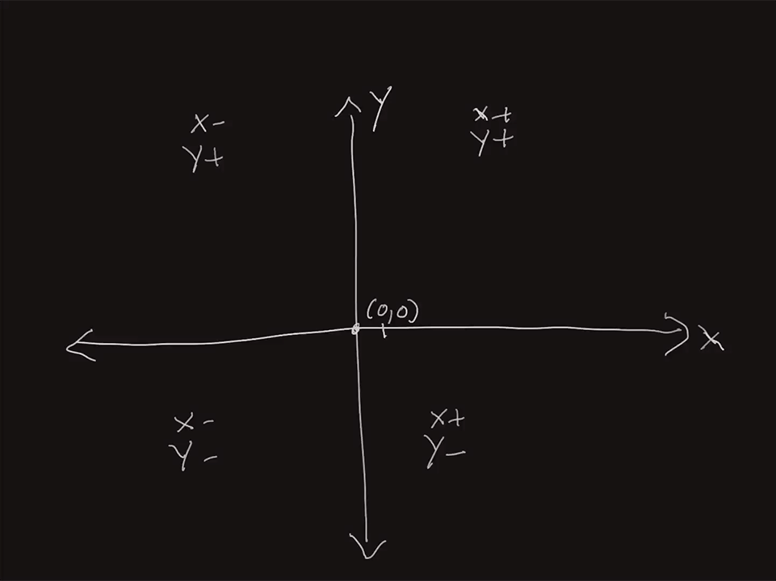

##### `Step 3.`\|`GMGS`|:small_blue_diamond: :small_blue_diamond: :small_blue_diamond:

**GameMaker** is slightly different.  First point *(0,0)* is at the top left corner of the room.  **Y** is positive going down and *negative* moving **upwards**. So the quadrant that the room is in is all x-axis positive and y-axis positive.  Moving downscreen is also y positive.  The top right corner of the room is the *(0, room_width)*. The bottom left corner is *(0, room_height)* and the bottom right is *(room_width, room_height)*.  The top center is *(room_width/2, 0)*.  The middle center is *(room_width/2, room_height/2)*.  

##### `Step 4.`\|`GMGS`|:small_blue_diamond: :small_blue_diamond: :small_blue_diamond: :small_blue_diamond:

Create a new room called `rm_position_objects` and place it at the top of the **Room Order** list.

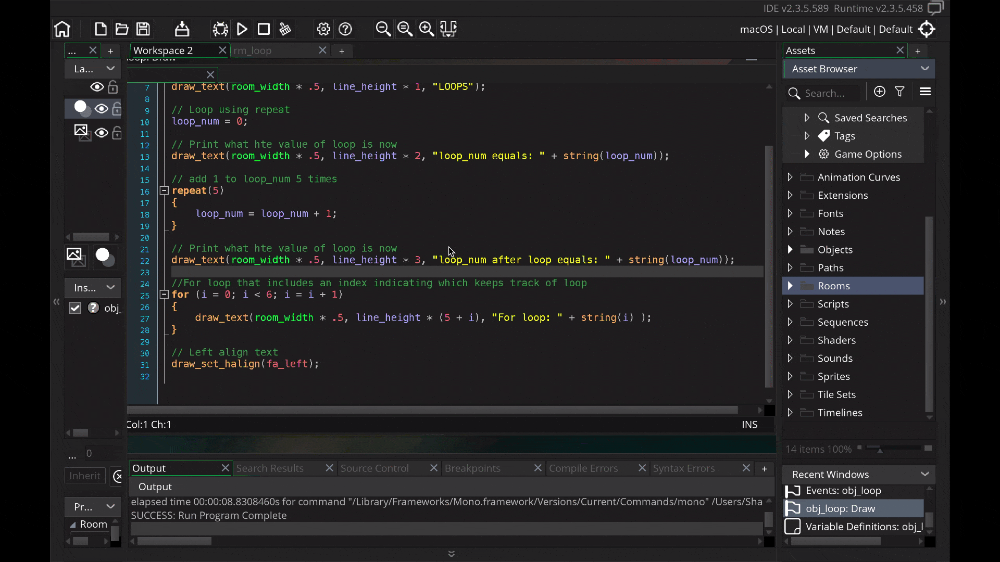

##### `Step 5.`\|`GMGS`| :small_orange_diamond:

Open the room **rm_position_objects**. We do not use hard coded numbers for the room height and width.  That way we can change the size of the room and our game will still work.  If you go to the room you will see the **Width** and **Height** and these are the same values stored in `room_width` and `room_height`.

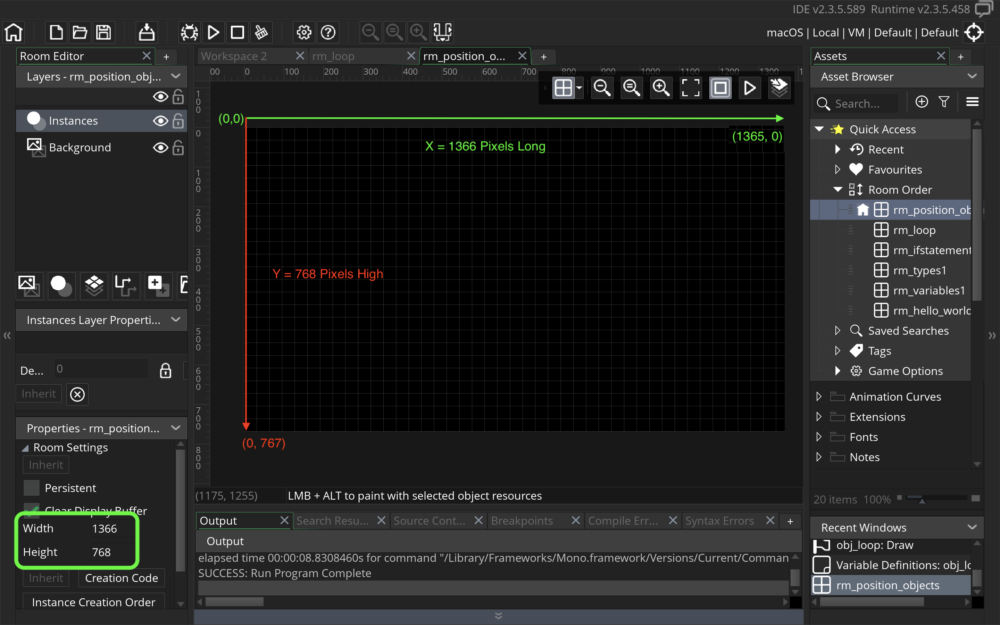

##### `Step 6.`\|`GMGS`| :small_orange_diamond: :small_blue_diamond:

Right click on **Objects** and select **Create | Object** called `obj_position_objects`. Add a **Draw | Draw** event to draw to screen.

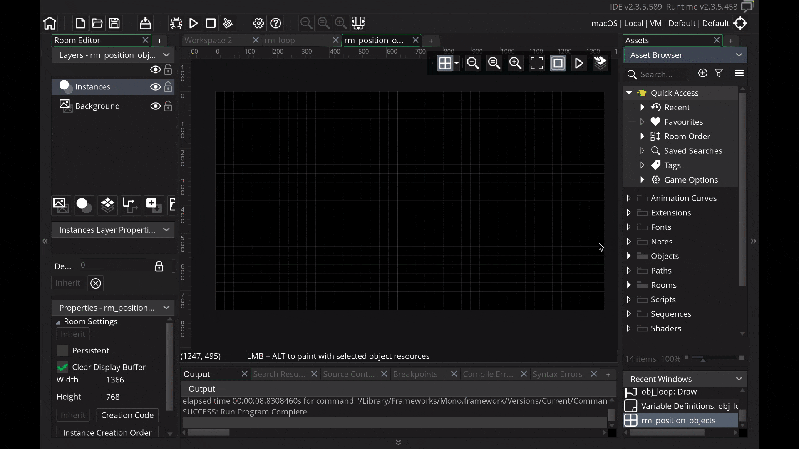

##### `Step 7.`\|`GMGS`| :small_orange_diamond: :small_blue_diamond: :small_blue_diamond:

Press the <kbd>Variable Definitions</kbd> button and then press the <kbd>Add</kbd> button.  **Name** the variable `line_height` and set the **Default** to `22`.  Change the **Type** to `integer`.

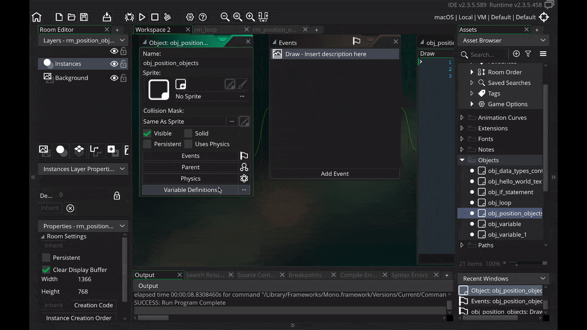

##### `Step 8.`\|`GMGS`| :small_orange_diamond: :small_blue_diamond: :small_blue_diamond: :small_blue_diamond:

Now add to the **Draw** script:

* Center align text
* Draw a title in the middle of the screen
* Reset text alignment

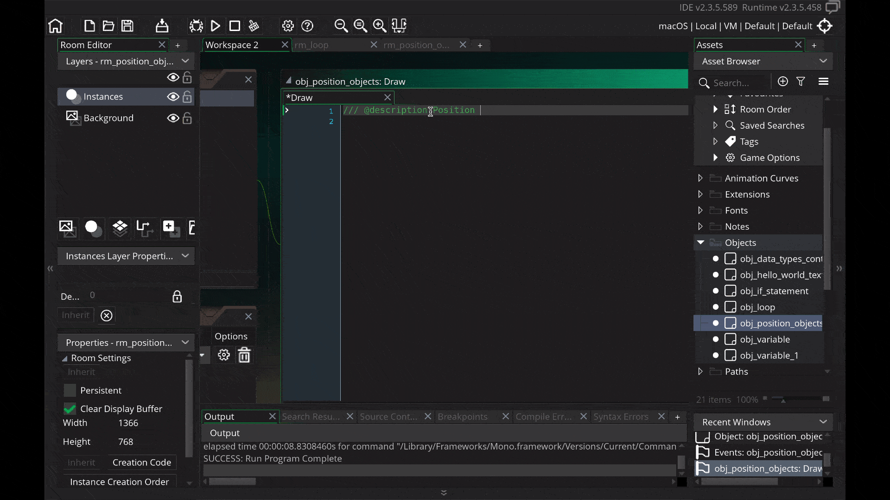

##### `Step 9.`\|`GMGS`| :small_orange_diamond: :small_blue_diamond: :small_blue_diamond: :small_blue_diamond: :small_blue_diamond:

Add a **obj_position_objects** to **rm_position_objects**.  Now *press* the <kbd>Play</kbd> button in the top menu bar to launch the game. See the title in the center of the screen.

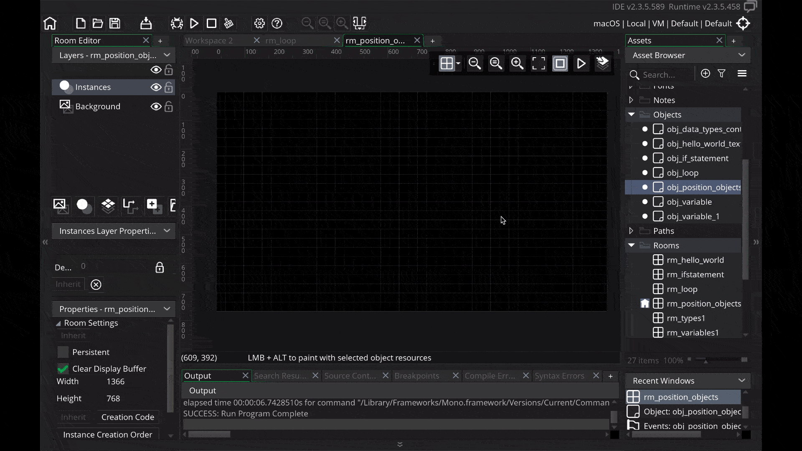

##### `Step 10.`\|`GMGS`| :large_blue_diamond:

So if we want to draw a line underneath, then we can figure out 2 steps of 22 pixels down on the y-axis.  This gets us to `44` pixels down on the y axis. The x-axis would go from `0` to `room_width -1` to draw a line right across the screen.

Why `room_width - 1`? This is because the first pixel on the left is accessed with unit `0` so a the last pixel is the width of the room minus one pixel (as 0 is one). 

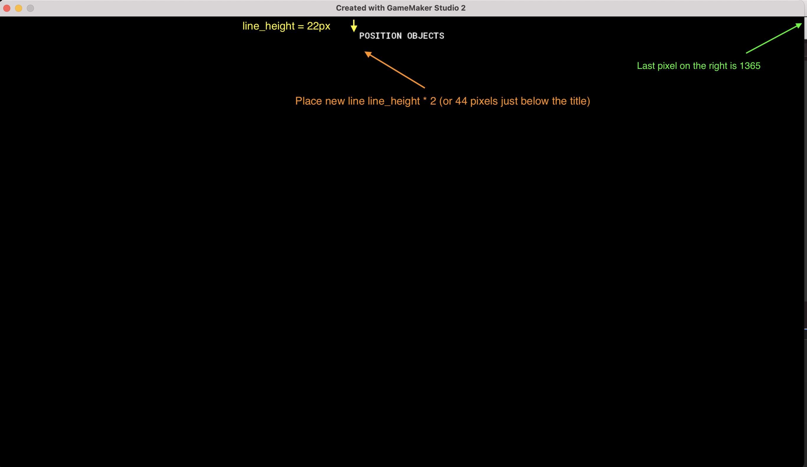

##### `Step 11.`\|`GMGS`| :large_blue_diamond: :small_blue_diamond: 

Let's use **[draw_line(x1, y1, x2, y2)](https://manual.yoyogames.com/#t=GameMaker_Language%2FGML_Reference%2FDrawing%2FBasic_Forms%2Fdraw_line.htm)**. `(x1, y1)` is the start of the line, and `(x2, y2)` is the end of the line. We are also going to use **[draw_set_color(color)](https://manual.yoyogames.com/GameMaker_Language/GML_Reference/Drawing/Colour_And_Alpha/draw_set_colour.htm)**.  We will pass as an argument to this function the *enumerator* `c_yellow`.  We will reset the color back to white after drawing the line.  Type the following to the bottom of the **obj_data_types_controller Draw Event**.

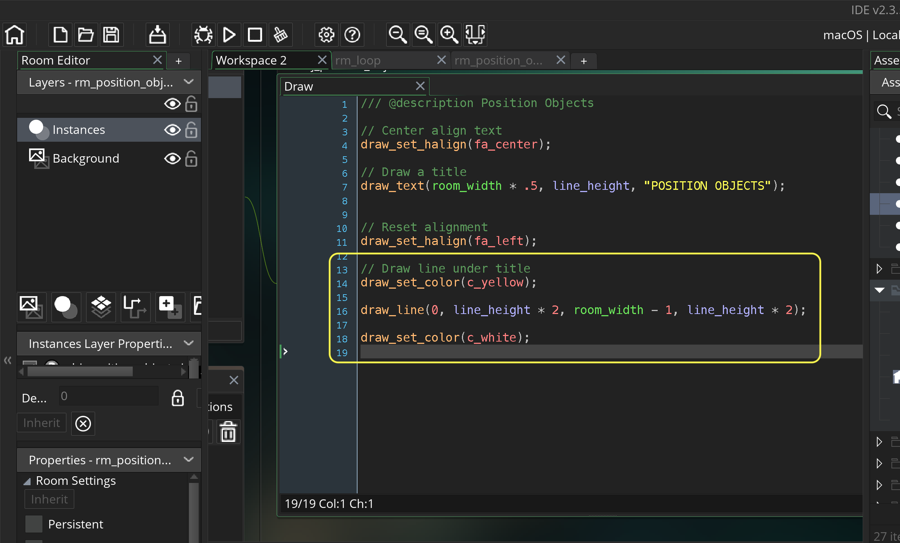

##### `Step 12.`\|`GMGS`| :large_blue_diamond: :small_blue_diamond: :small_blue_diamond: 

Now *press* the <kbd>Play</kbd> button in the top menu bar to launch the game. We should see a yellow line under the text.

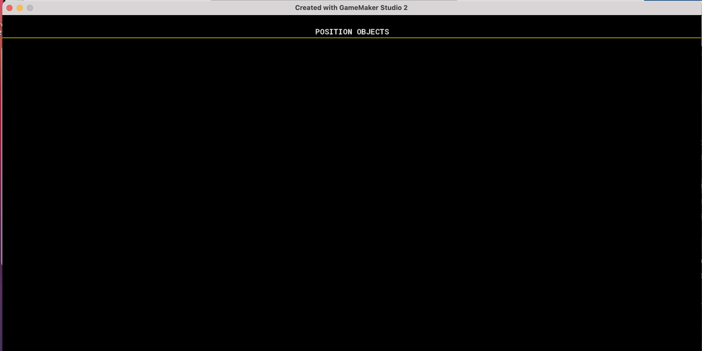

##### `Step 13.`\|`GMGS`| :large_blue_diamond: :small_blue_diamond: :small_blue_diamond:  :small_blue_diamond: 

Lets look at placing 2-D sprites, something more game-y, into this two dimensional room.  We will put a red triangle, blue square and green circle on line 25 from the far left, center and right respectively.  We want it to look like: 

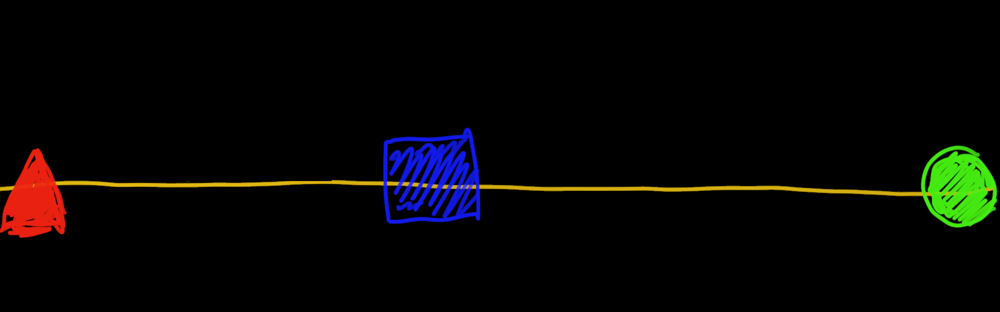

##### `Step 14.`\|`GMGS`| :large_blue_diamond: :small_blue_diamond: :small_blue_diamond: :small_blue_diamond:  :small_blue_diamond: 

Lets start by drawing another line on line 6.  You can just repeat the previous line draw but change it slightly.  Type in another line draw like so:

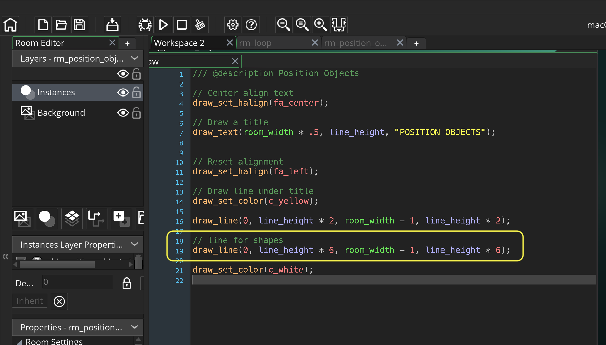

##### `Step 15.`\|`GMGS`| :large_blue_diamond: :small_orange_diamond: 

Now *press* the <kbd>Play</kbd> button in the top menu bar to launch the game. We should see a second yellow line.

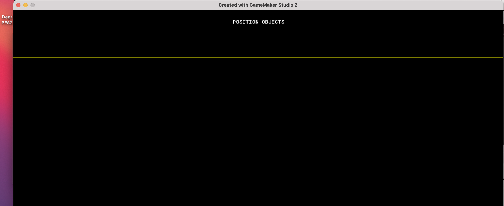

##### `Step 16.`\|`GMGS`| :large_blue_diamond: :small_orange_diamond:   :small_blue_diamond: 

We want to create a new **sprite**. *Right click* the right mouse button on the **Sprites** title in the **Asset Browser** tab and select **Create | Sprite**. Change the name to `spr_triangle`. 

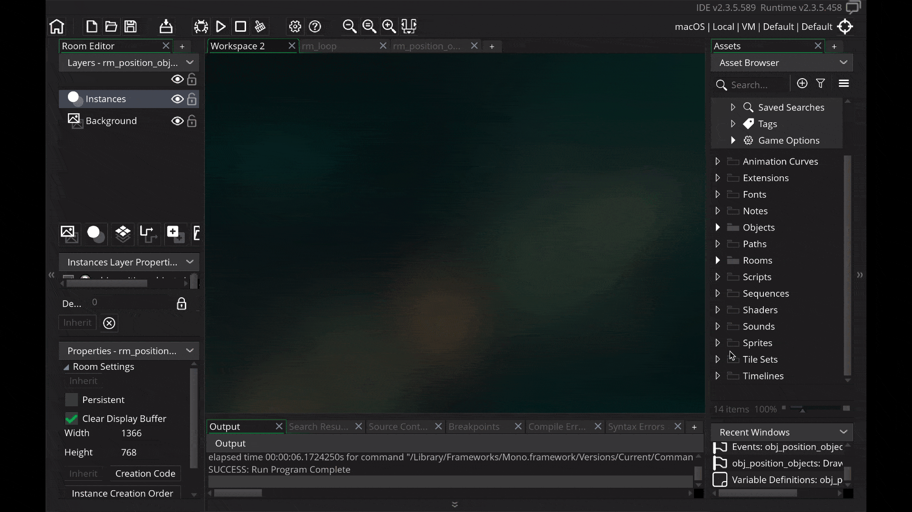

##### `Step 17.`\|`GMGS`| :large_blue_diamond: :small_orange_diamond: :small_blue_diamond: :small_blue_diamond:

Look at the the sprite tab and see the size of the sprite.  It defaults to `64` by `64` pixels which we will keep.  Please note that this size is a mutliple of 8, something that is very common when selecting sprite sizes.  Once you have seen this screen press the Edit Sprite button to create the actual artwork.

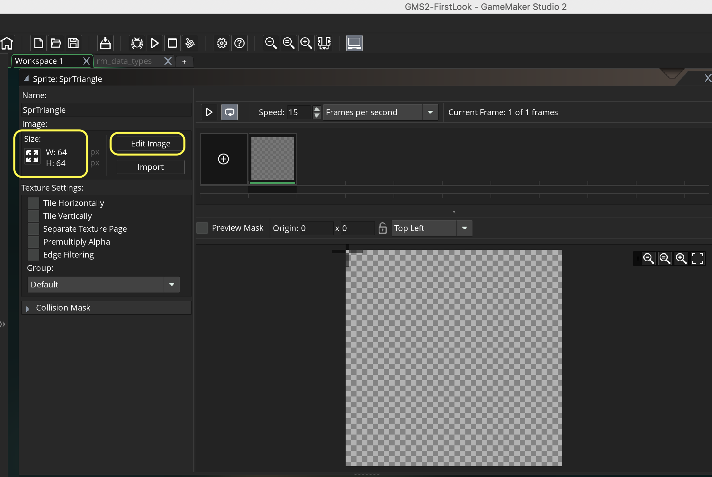

##### `Step 18.`\|`GMGS`| :large_blue_diamond: :small_orange_diamond: :small_blue_diamond: :small_blue_diamond: :small_blue_diamond:

We want the triangle to be *red*.   *Press* the left mouse button on the red color in the palette to pick the fill color that we want.  *Select* the lower right half of the **Polygon Tool**.  The top left is the stroke and the bottom right is the fill.  We just need to set a fill color for this sprite.

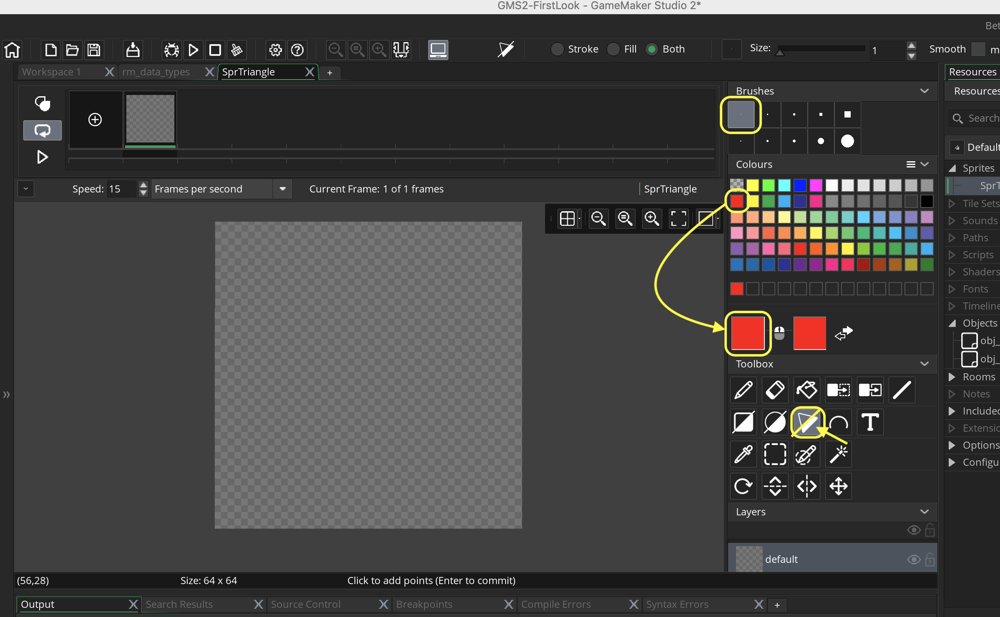

##### `Step 19.`\|`GMGS`| :large_blue_diamond: :small_orange_diamond: :small_blue_diamond: :small_blue_diamond: :small_blue_diamond: :small_blue_diamond:

We want to draw all of our sprites to be facing to the right hand side of the screen.  The starting rotation for all sprites is right facing (positive along the x-axis).  Start to draw it by pressing top left corner, middle right corner, bottom left corner then left center about 20 pixels in to give it a tail, to know we are pointing right.

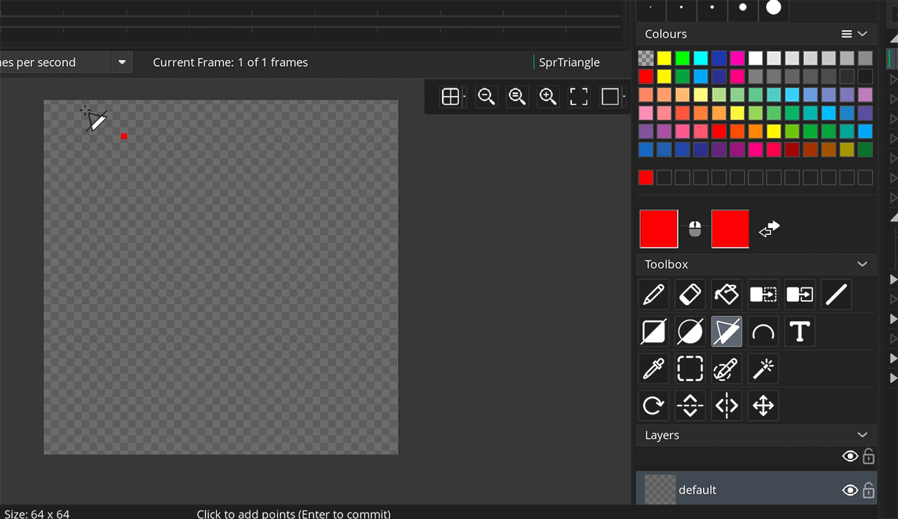

##### `Step 20.`\|`GMGS`| :large_blue_diamond: :large_blue_diamond:

The triangle sprite should look like this:

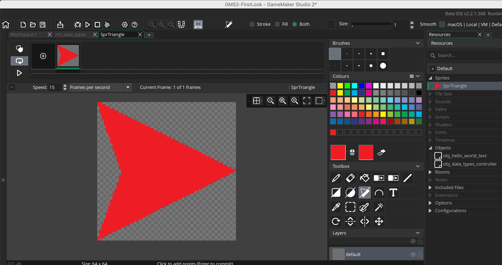

##### `Step 21.`\|`GMGS`| :large_blue_diamond: :large_blue_diamond: :small_blue_diamond:

We want to create another sprite, this time a blue square.  *Right click* the right mouse button on the **Sprites** title in the **Asset Browser** tab and select **Create | Sprite**. *Change* the name to `spr_square`.  Once you have seen this screen press the <kbd>Edit Sprite</kbd> button to create the actual artwork. *Press* the left mouse button on the blue color in the palette to pick the fill color that we want.  Select the the **Fill Tool** and click within the window to fill the entire sprite with blue.

___

<!--  -->

| [previous](../loops/README.md#user-content-gms2-loops)| [home](../README.md#user-content-gamemaker-studio-2-getting-started) | [next](../positioning-text-2/README.md#user-content-screen-positioning-ii)|
|---|---|---|

