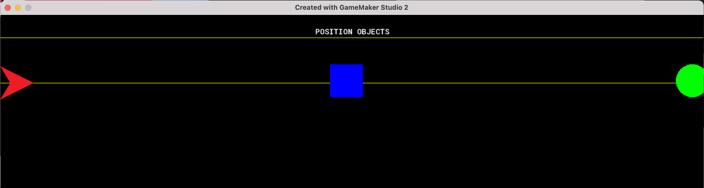

### Screen Positioning II

[previous](../spositioning-text/README.md#user-content-gms2-positioning-text) • [home](../README.md#user-content-gamemaker-studio-2-getting-started) • [next](../variables/README.md#user-content-gms2-variables)

Lets take a closer look at how we position text, objects and other items on screen.

 

---

##### `Step 1.`\|`GMGS`|:small_blue_diamond:

Repeat this one last time for a sprite called `spr_circle`.  Press **Edit Sprite** and select the *green* color and the bottom right of the **Draw Circle** tool and draw a nice green circle.  Make sure it fills the entire 64 b6 64 frame and is symmetrial in all four corners.

##### `Step 2.`\|`GMGS`|:small_blue_diamond: :small_blue_diamond: 

We can't place a sprite in the room we have to bind it to an game object. *Right click* on **Object** and select **Create | Object**.  Call this object `obj_triangle`.  Press the button that says <kbd>No Sprite</kbd> and pick the `spr_triangle` **sprite** from the drop down menu.

##### `Step 3.`\|`GMGS`|:small_blue_diamond: :small_blue_diamond: :small_blue_diamond:

Now lets create an object for the square. *Right click* on **Object** and select **Create | Object**.  *Call* this object `obj_square`.  Press the button that says <kbd>No Sprite</kbd> and pick the `spr_square` sprite from the drop down menu.

##### `Step 4.`\|`GMGS`|:small_blue_diamond: :small_blue_diamond: :small_blue_diamond: :small_blue_diamond:

Now lets create an object for the circle. *Right click* on *Object* and select **Create | Object**.  Call this object `obj_circle`.  *Press* the button that says <kbd>No Sprite</kbd> and pick the `spr_circle` sprite from the drop down menu.

##### `Step 5.`\|`GMGS`| :small_orange_diamond:

Please note a consistency here.  We are naming all objects with prefix obj_ and all sprites spr_.  This is because we can't have two files with the same name.  We might have various different types of assets with the name circle (for example). This allows us to share a name but not have a problem with collision on two game items with the exact same name.  It also makes it easier to figure out which sprite goes with which objects.  In a small object like this it is simple, but if we had 200 sprites and objects this would be harder to tell without following a consistent naming convention.

*Double left click* **rm_position_objects]** and drag the triangle, circle and square into the room around where you think line 25 lies by eye.

##### `Step 6.`\|`GMGS`| :small_orange_diamond: :small_blue_diamond:

Now *press* the <kbd>Play</kbd> button in the top menu bar to launch the game. We should see the three shapes and through trial and error want them to be on the center of the line.

##### `Step 7.`\|`GMGS`| :small_orange_diamond: :small_blue_diamond: :small_blue_diamond:

*Double left click* **obj_triangle** and we need to add a variable to this object.  *Press* the **Variable Definition** button on the game object. 

##### `Step 8.`\|`GMGS`| :small_orange_diamond: :small_blue_diamond: :small_blue_diamond: :small_blue_diamond:

Press the <kbd>Add</kbd> button and call the variable `line_height` and set the **Default** value to `22`.  Make sure the **Type** is a `Integer`.

##### `Step 9.`\|`GMGS`| :small_orange_diamond: :small_blue_diamond: :small_blue_diamond: :small_blue_diamond: :small_blue_diamond:

GameMaker uses an **[event system](https://manual.yoyogames.com/The_Asset_Editors/Object_Properties/Object_Events.htm)** to run its scripts. We have already used the **Draw** event to draw the text and lines in this room.  The draw event runs every frame.

We will take a look at two more event types: **Create Events** & **Step Events**

The **[Create Event](https://manual.yoyogames.com/The_Asset_Editors/Object_Properties/Object_Events.htm)** runs only one time when the object is instantiated (when it appears in the room). This could be at the game start if the object is placed in the Room; or it could be run once when it is instantiated through code. This is the perfect time to set up the inital value for a variable. Please note that this will be shared amongst all instances, if you want a separate value for a specific instance use the editor in the room to adjust the variable value.  The room settings run after the Create Event and will override what is placed there.

The **[Step Event](https://manual.yoyogames.com/The_Asset_Editors/Object_Properties/Object_Events.htm)** is the main game loop. It runs every frame when the game is running. The code attached to this event runs every tick. Typically we instantiate variables in the Create event and run ai and gameplay in the step event. The step event (like the draw event) runs every frame so be careful to use it for something that needs to be updated 30+ times a second. 

##### `Step 10.`\|`GMGS`| :large_blue_diamond:

For positioning the objects in the room we will use the create event.  We only need to do this once and there is only a single instance of each object (don't need to do it in the room).  
	
*Double click* on **obj_triangle** and press the <kbd>Events</kbd> button then press the <kbd>AddEvent button</kbd> .  In the menu select `Create` event. *Scroll* over to the scripting window that flew out. 

##### `Step 11.`\|`GMGS`| :large_blue_diamond: :small_blue_diamond: 

Now we want the obj_triangle to be on the sixth line (6 * line_height or 6 * 22 pixes).  On the x-axis we want it on the left hand side of the screen.  Remember 0,0 is the top left corner so we want to be 0 on the x-axis.

##### `Step 12.`\|`GMGS`| :large_blue_diamond: :small_blue_diamond: :small_blue_diamond: 

In scripting we are adjusting two variables that come with every object.  All objects have a built in **X** and **Y** variable that represent their 2-d position in the room.

##### `Step 13.`\|`GMGS`| :large_blue_diamond: :small_blue_diamond: :small_blue_diamond:  :small_blue_diamond: 

Now *press* the <kbd>Play</kbd> button in the top menu bar to launch the game. Now we should see the triangle in the correct position on the x-axis but it is below the line as opposed to being centered on it.

##### `Step 14.`\|`GMGS`| :large_blue_diamond: :small_blue_diamond: :small_blue_diamond: :small_blue_diamond:  :small_blue_diamond: 

The game bases everything on the object's origin.  This is a single point relative to the object (it can be anywhere relative to the object, even outside of the sprite itself).  The default position if you do not make any changes is the top left corner of the sprite.  The world position of the sprite is it's location in the room `(0, 6 * line_height)` but it's local origin position is `(0, 0)` with the anchor point at the top left corner.

##### `Step 15.`\|`GMGS`| :large_blue_diamond: :small_orange_diamond: 

The good news is that we can change the origin. Open **spr_triangle** and press the <kbd>Edit</kbd> button. *Click* on the drop down menu that says **Top Left**.  Select `Middle Center` instead.  Look at the target reticule update automatically:

##### `Step 16.`\|`GMGS`| :large_blue_diamond: :small_orange_diamond:   :small_blue_diamond: 

Now *press* the <kbd>Play</kbd> button in the top menu bar to launch the game. Now the vertical positioning is better but half the ship is off the screen to the left.  It placed the origin of the sprite at 0 on the x-axis.

##### `Step 17.`\|`GMGS`| :large_blue_diamond: :small_orange_diamond: :small_blue_diamond: :small_blue_diamond:

Now we need to compensate for where the sprite's origin is located.  It is located at *(32, 32)* which is half the `sprite_get_width(spr_circle)`.  So we can adjust **x** to be `32`.

##### `Step 18.`\|`GMGS`| :large_blue_diamond: :small_orange_diamond: :small_blue_diamond: :small_blue_diamond: :small_blue_diamond:

Now *press* the <kbd>Play</kbd> button in the top menu bar to launch the game. Now the triangle should be properly placed both horizontally and vertically.

##### `Step 19.`\|`GMGS`| :large_blue_diamond: :small_orange_diamond: :small_blue_diamond: :small_blue_diamond: :small_blue_diamond: :small_blue_diamond:

What if down the road I wanted to make a change and have the sprite be **32 x 32** pixels.  Then I would have to change this value.  There is a way to not hard code this value and have it change with the <a href="gms2tutorials:///ShowHelp?tag=sprite_get_width">**[sprite_get_width](https://manual.yoyogames.com/GameMaker_Language/GML_Reference/Asset_Management/Sprites/Sprite_Information/sprite_get_width.htm)**.

##### `Step 20.`\|`GMGS`| :large_blue_diamond: :large_blue_diamond:

Now *press* the <kbd>Play</kbd> button in the top menu bar to launch the game. It should look identical as we just converted that real number into a variable.

##### `Step 21.`\|`GMGS`| :large_blue_diamond: :large_blue_diamond: :small_blue_diamond:

Lets do the same thing with **obj_square**.  Let's start by clicking on **Variable Definitions**  and press <kbd>Add</kbd> button. Name the variable `line_height` and set the **Default** value to `22` with a type of `Integer`.

___

| [previous](../positioning-text/README.md#user-content-gms2-positioning-text)| [home](../README.md#user-content-gamemaker-studio-2-getting-started) | [next](../variables/README.md#user-content-gms2-variables)|
|---|---|---|

