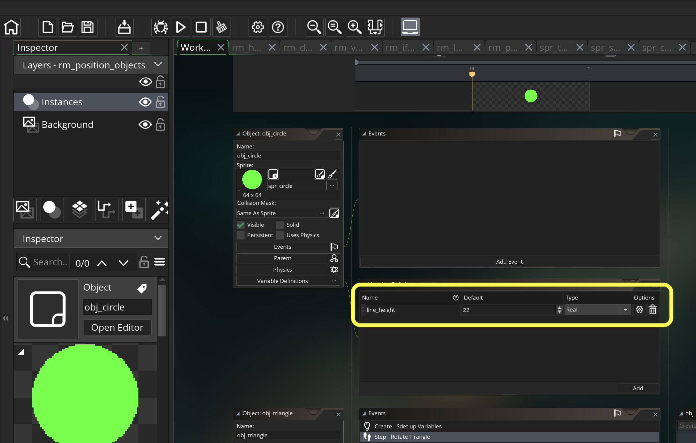
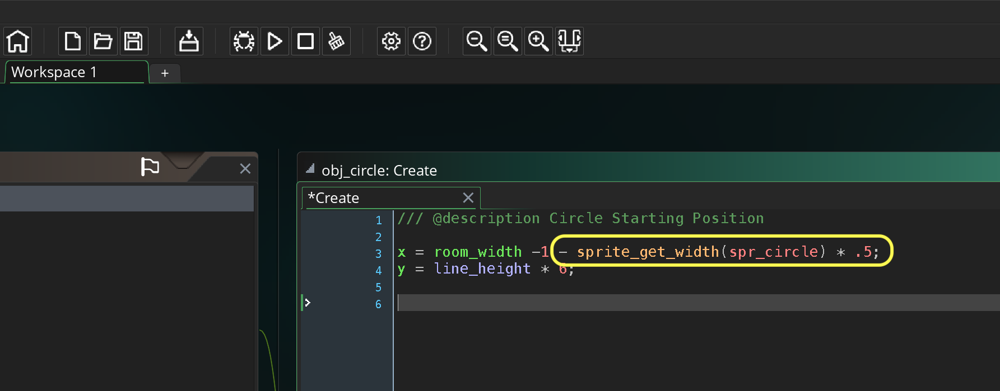

### Screen Positioning III

[previous](../positioning-text-2/README.md#user-content-screen-positioning-ii) • [home](../README.md#user-content-gamemaker-studio-2-getting-started) • [next](../errors/README.md#user-content-errors)

Lets take a closer look at how we position text, objects and other items on screen.

 

---

##### `Step 1.`\|`GMGS`|:small_blue_diamond:

Press the <kbd>Add Event</kbd> button and select a **Create** event.

##### `Step 2.`\|`GMGS`|:small_blue_diamond: :small_blue_diamond: 

In this case we want the middle of the room and we can divide the `room_width` variable by `2` (or multiply by `0.5`). The **y** value will be the same as `obj_square`.

##### `Step 3.`\|`GMGS`|:small_blue_diamond: :small_blue_diamond: :small_blue_diamond:

Now *press* the <kbd>Play</kbd> button in the top menu bar to launch the game. We notice that it has the same problem that it is positioned based on it's top left corner.

##### `Step 4.`\|`GMGS`|:small_blue_diamond: :small_blue_diamond: :small_blue_diamond: :small_blue_diamond:

Now there are other reason's besides positioning the sprite to adjust the origin.  Another consideration is when we want to rotate the sprite.  

We will be using a different event type to rotate the object.  Since this is not just happening on one frame we need to rotate it every frame.  This is the perfect time to use our second event type a Step event.  Press the <kbd>Add Event</kbd> button and select **Step | Steps** from the menu.

##### `Step 5.`\|`GMGS`| :small_orange_diamond:

To rotate the player there is a variable that is used to determine the angle the player is facing at.  The variable is called **[image_angle](https://manual.yoyogames.com/GameMaker_Language/GML_Reference/Asset_Management/Sprites/Sprite_Instance_Variables/image_angle.htm)**.

`image_angle` is set by changing its angle in degrees.	To rotate counter-clockwise we add degrees *positively* then we rotate clockwise by *subtracting* degrees.  You can see below that a round trip is 360 degrees.

##### `Step 6.`\|`GMGS`| :small_orange_diamond: :small_blue_diamond:

We will start by rotating counter-clockwise.  We will add 5 degrees every frame.  The level defaults to 30 frames a second so it will be rotating 5 * 30 = 150 degrees per second. To alter the `image_angle` variable we will add 5 degrees to itself.  So it starts at 0, goes to 5 in the second frame, 10 in the third frame, 15 in the fourth frame etc...

##### `Step 7.`\|`GMGS`| :small_orange_diamond: :small_blue_diamond: :small_blue_diamond:

Now *press* the <kbd>Play</kbd> button in the top menu bar to launch the game. Notice that the axis the sprite rotates around is its origin.  This is at the top left corner.  

##### `Step 8.`\|`GMGS`| :small_orange_diamond: :small_blue_diamond: :small_blue_diamond: :small_blue_diamond:

Now lets prove that changing the origin will alter the point of rotation.  If this is the case the triangle should rotate on its center.  Lets *add* a **Step | Step** event to `obj_triangle` by pressing the **Add Event** button.

##### `Step 9.`\|`GMGS`| :small_orange_diamond: :small_blue_diamond: :small_blue_diamond: :small_blue_diamond: :small_blue_diamond:

Lets rotate the triangle clockwise so we will subtract by 5 each frame. So it starts at 0, goes to -5 in the second frame, -10 in the third frame, -15 in the fourth frame etc... Add the following script to obj_triangle.

##### `Step 10.`\|`GMGS`| :large_blue_diamond:

Now *press* the <kbd>Play</kbd> button in the top menu bar to launch the game. Notice that the triangle rotates on the axis whose origin is centered horizontally and vertically wihin the sprite:

##### `Step 11.`\|`GMGS`| :large_blue_diamond: :small_blue_diamond: 

Now lets go back and fix the origin on the square so it is positioned in the center and rotates in the middle of the sprite.  Open spr_square and click on the drop down menu that says Top Left.  Change the **Origin** to ** Middle Center** instead.  Look at the target reticule update automatically:

##### `Step 12.`\|`GMGS`| :large_blue_diamond: :small_blue_diamond: :small_blue_diamond: 

Now *press* the <kbd>Play</kbd> button in the top menu bar to launch the game. Notice that the square is now centered vertically and rotates on its center.

##### `Step 13.`\|`GMGS`| :large_blue_diamond: :small_blue_diamond: :small_blue_diamond:  :small_blue_diamond: 

Now lets get the circle positioned properly.  Add a **Variable Definition** to `obj_circle` called `line_height` and set it to `22` with a **Type** of `Real`.

##### `Step 14.`\|`GMGS`| :large_blue_diamond: :small_blue_diamond: :small_blue_diamond: :small_blue_diamond:  :small_blue_diamond: 

We need to position it in the center at the right far end corner.  Now we need to add a **Create** event to `obj_circle`.

##### `Step 15.`\|`GMGS`| :large_blue_diamond: :small_orange_diamond: 

Where is the far right side of the room?  We can open up our current room and look to see what the width is.  It is set to 1024.  We could use this number but it would be hard coding the value.  We might want to adjust the room size when we are making changes later on.  There is a variable called `room_width` that holds this value.

##### `Step 16.`\|`GMGS`| :large_blue_diamond: :small_orange_diamond:   :small_blue_diamond: 

Ok, lets set the y on the y-axis to the 6th line and set the x to room_width.  Type the below script in obj_circle: Create event.

##### `Step 17.`\|`GMGS`| :large_blue_diamond: :small_orange_diamond: :small_blue_diamond: :small_blue_diamond:

Now *press* the <kbd>Play</kbd> button in the top menu bar to launch the game. Woops we have a major problem.  It looks like there is nothing in the room.  We do not see the circle at all.  Now that does not mean it is not in the game, it just means that it is not in the room.  In fact, it is one pixel outside the room on the right.  Since we have put it on the very right hand side of the room and its origin is on its left side it is just outside the room.  In the image below the dotted circle represents the approximate position of this sprite that we can't see. Woops we have a major problem.  It looks like there is nothing in the room.  We do not see the circle at all.  Now that does not mean it is not in the game, it just means that it is not in the room.  In fact, it is one pixel outside the room on the right.  Since we have put it on the very right hand side of the room and its origin is on its left side it is just outside the room.  In the image below the dotted circle represents the approximate position of this sprite that we can't see.

##### `Step 18.`\|`GMGS`| :large_blue_diamond: :small_orange_diamond: :small_blue_diamond: :small_blue_diamond: :small_blue_diamond:

Open up **spr_circle** and center the origin like we did previously on the other two sprites:

##### `Step 19.`\|`GMGS`| :large_blue_diamond: :small_orange_diamond: :small_blue_diamond: :small_blue_diamond: :small_blue_diamond: :small_blue_diamond:

RuNow *press* the <kbd>Play</kbd> button in the top menu bar to launch the game. Now that is a bit better now only half the sprite is off the screen.  This makes sense as it puts the origin (center of the circle) at the right edge of the screen.  We need to move it to the left by half a sprite width:

##### `Step 20.`\|`GMGS`| :large_blue_diamond: :large_blue_diamond:

Go back to **obj_circle** and adjust its **Create** script by subtracting `sprite_width * .5` (same as dividing `sprite_get_width(spr_circle)` by two).  Notice that we put it in parenthesis.  We do not need to do this is because it will do the multiplication BEFORE the subtraction but we are doing it to be clear on what we intend to do.

##### `Step 21.`\|`GMGS`| :large_blue_diamond: :large_blue_diamond: :small_blue_diamond:

Now *press* the <kbd>Play</kbd> button in the top menu bar to launch the game. Now all the sprites are positioned properly!

##### `Step 22.`\|`GMGS`| :large_blue_diamond: :large_blue_diamond: :small_blue_diamond: :small_blue_diamond:

Now you can finish this room off yourself by rotating the circle in a new step event.  Also, make sure you put a mark on the circle to actually see the rotation (a solid color will appear not to move). It should looks something like this.

___

##### `Step 23.`\|`GMGS`| :large_blue_diamond: :large_blue_diamond: :small_blue_diamond: :small_blue_diamond: :small_blue_diamond:

Select the **File | Save Project** then press **File | Quit** to make sure everything in the game is saved. If you are using **GitHub** open up **GitHub Desktop** and add a title and longer description (if necessary) and press the <kbd>Commit to main</kbd> button. Finish by pressing **Push origin** to update the server with the latest changes.

___

| `gms2.screen.positioning`\|`THE END`| 
| :--- |
| **That's All Folks!** That's it for screen positioning. |

<!--  -->

| [previous](../positioning-text-2/README.md#user-content-screen-positioning-ii)| [home](../README.md#user-content-gamemaker-studio-2-getting-started) | [next](../errors/README.md#user-content-errors)|
|---|---|---|
