### Setting Up

This tutorial is intended for those wanting an introduction to <i>GameMaker Studio 2</i> using their scrpting language <i>GML</i>. This assumes no prior knowledge of the software or scripting. This walk through looks various concepts.

 

---

##### `Step 1.`\|`ITA`|:small_blue_diamond:
*Run* **GameMaker Studio 2** to launch the software.  Login with the user name you created.<kbd> </kbd>

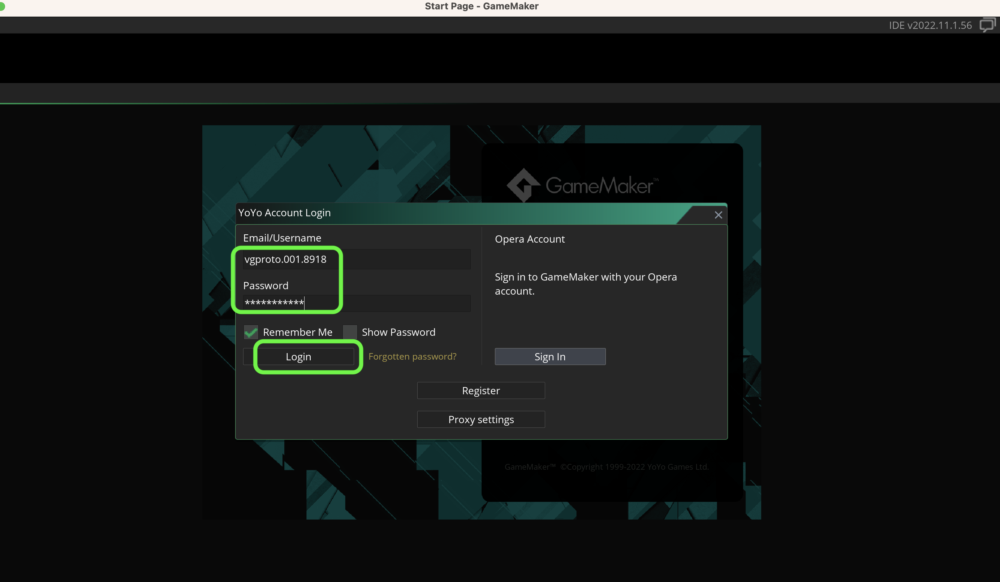

##### `Step 2.`\|`FHIU`|:small_blue_diamond: :small_blue_diamond: 

If this is the first time you have run the game you may have to install the Runtime Modules. Feel free to select **Required Only** and press the <kbd>OK</kbd> button.

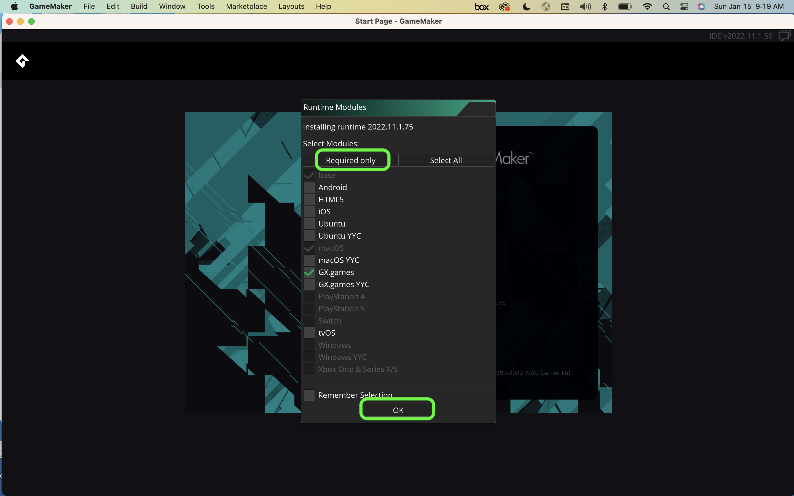

##### `Step 3.`\|`ITA`|:small_blue_diamond: :small_blue_diamond: :small_blue_diamond:

We will start a new project (or load up an existing one if we are continuing work). Press the <kbd>New</kbd> button to create a new project. Now we will start with a **Blank** project so press the <kbd>New Blank</kbd> button.

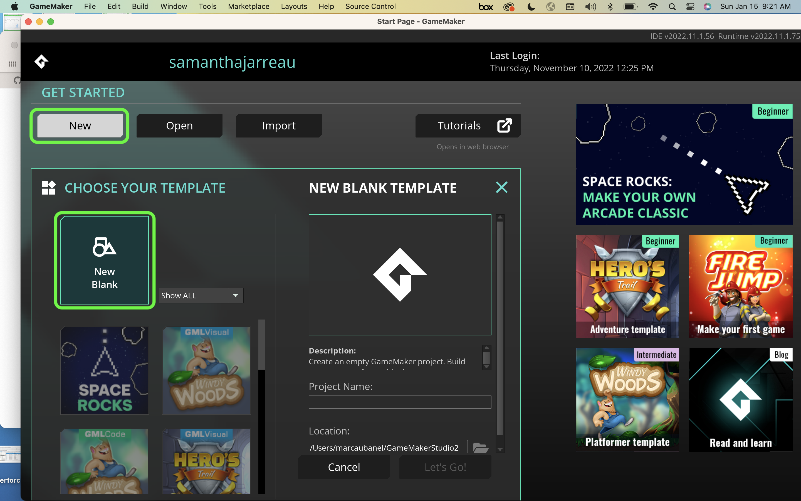

##### `Step 4.`\|`ITA`|:small_blue_diamond: :small_blue_diamond: :small_blue_diamond: :small_blue_diamond:

Enter the project name `GettingStarted`. Now you will select a directory and a name for the project.  I created a **GameMaker** directory in my **Documents Folder**. Press the <kbd>Let's Go</kbd> button to run the game.

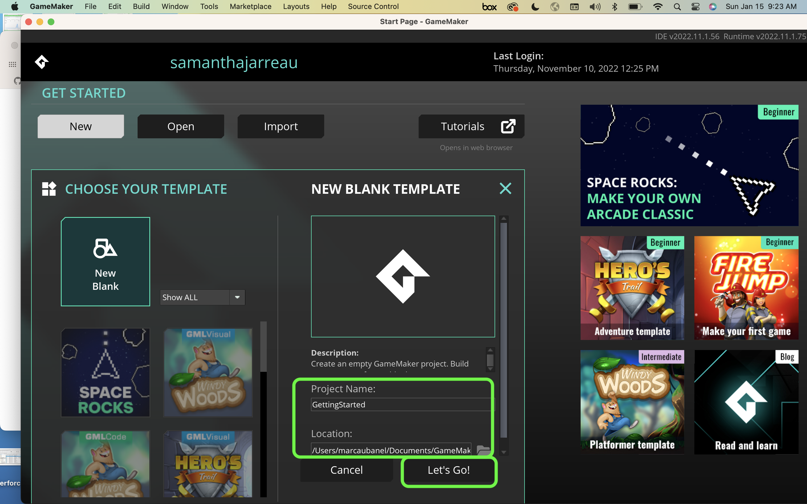

##### `Step 5.`\|`ITA`| :small_orange_diamond:

This will take you to an empty project window in the main game editor.

##### `Step 6.`\|`ITA`| :small_orange_diamond: :small_blue_diamond:

Now the folder that holds the project is named with the same name as the project in the folder you selected prior to this step. Never edit the content of this folder.  Only add and delete files from the game interface.  You run the risk of permanently damaging your project and having to start over again.

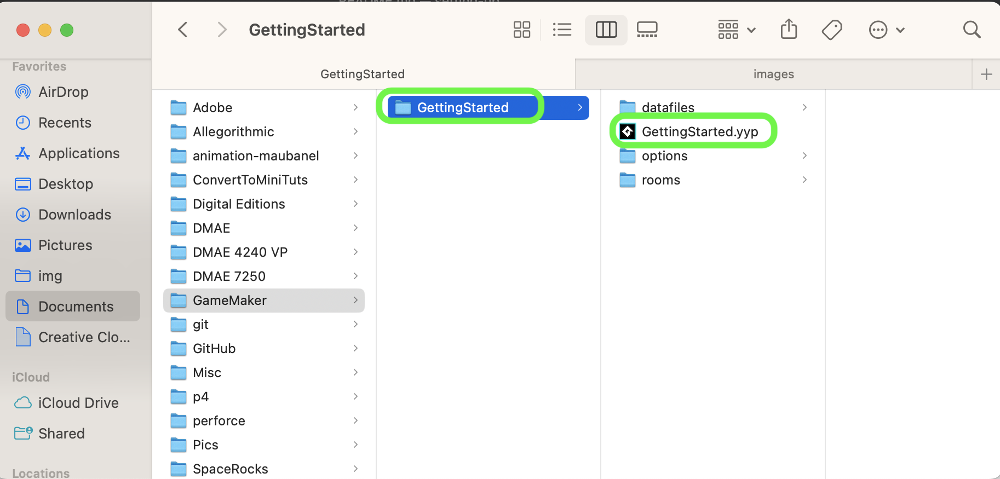

##### `Step 7.`\|`ITA`| :small_orange_diamond: :small_blue_diamond: :small_blue_diamond:
The **GameMaker** folder will contain a `.yyp` file which is the project file.  This is just a text file and the actual contents it needs are in the folders.  **Do Not** rename, delete or add any files through the finder/explorer/operating system.  **Do Not** rename the project file through finder/explorer/operating system. All changes need to be made in the editor. 

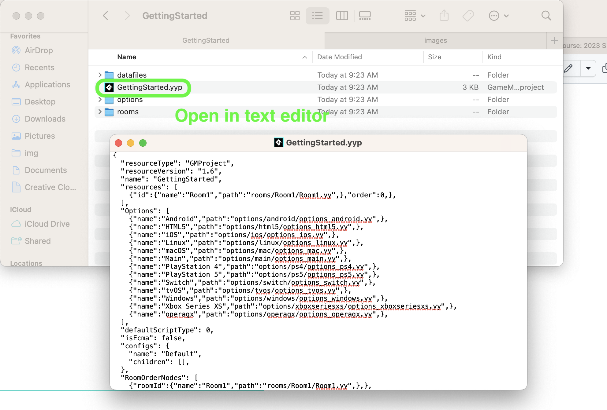

##### `Step 8.`\|`ITA`| :small_orange_diamond: :small_blue_diamond: :small_blue_diamond: :small_blue_diamond:

Select the **File | Save Project** then press **File | Quit** to make sure everything in the game is saved. Open up **GitHub Desktop** and select the project you are working on.  Add a **Commit Title** and **Description**.  Press the <kbd>Commit to main</kbd> button.  Then press the <kbd>Publish branch</kbd> (very first commit) or <kbd>Push branch</kbd> (every subsequent push) to upload all changes to the server.

##### `Step 2.`\|`FHIU`|:small_blue_diamond: :small_blue_diamond: 

Click on the **[GitHub Classroom Link](https://classroom.github.com/a/fDx3oNlD)** if you want a repository to use for the game. Press the <kbd>Accept this assignment</kbd> button. 

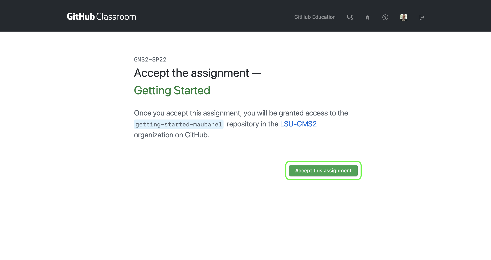

##### `Step 3.`\|`SPCRK`|:small_blue_diamond: :small_blue_diamond: :small_blue_diamond:

You will now be sent to a message that says the repository is being configured.  Wait a few seconds then press the refresh button.

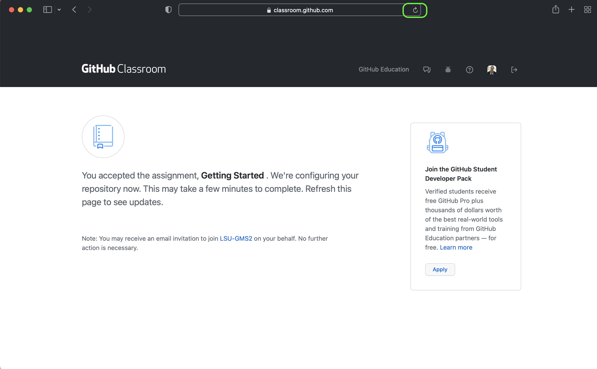

##### `Step 4.`\|`SPCRK`|:small_blue_diamond: :small_blue_diamond: :small_blue_diamond: :small_blue_diamond:

Eventually you will get a link to the repository that **GitHub Classroom** has created.  *Click* on the link to your new repository.

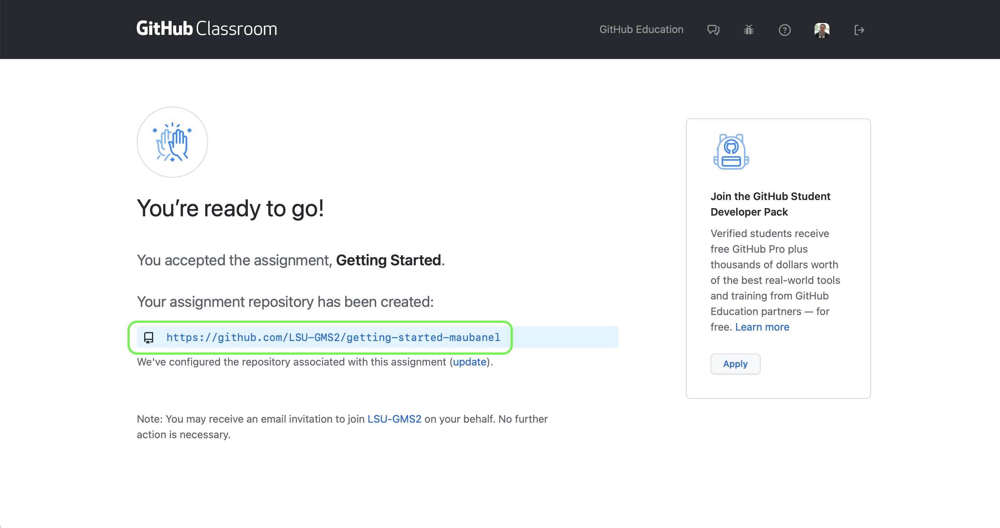

##### `Step 5.`\|`SPCRK`| :small_orange_diamond:

You get to your empty repository on **GitHub**.

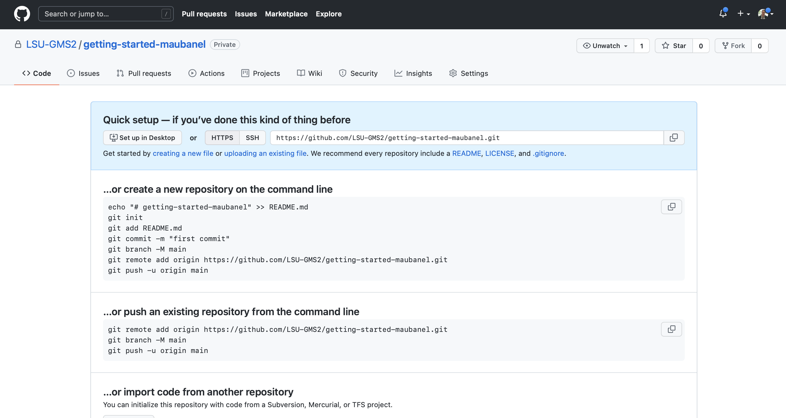

##### `Step 6.`\|`SPCRK`| :small_orange_diamond: :small_blue_diamond:

Open up **GitHub Desktop** and select **File | New Repository** to create a **GitHub** repository inside the **Getting Started** project you just created.

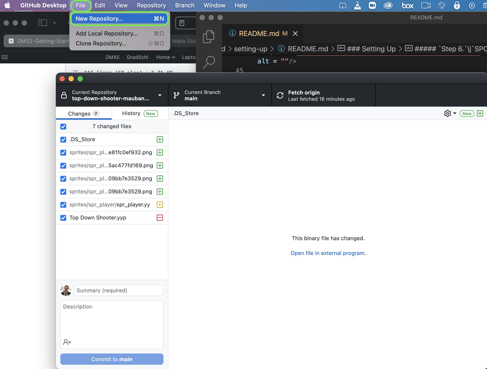

##### `Step 7.`\|`SPCRK`| :small_orange_diamond: :small_blue_diamond: :small_blue_diamond:

Now we want the project to be in the same folder as the `.yyp` project filename (in this case Space Rocks).  You then need to set the **name** the exact name of the folder that holds the project.  So in my case the folder that contained the project was **Documents | GitHub**.  So I use this as the **Local Path**.  For the **Name** I use the project folder `Space-Rocks`. It has to be spelled EXACTLY the same way as the one that holds the **GameMaker** project. This way it will create a git repository in this folder without creating a new folder.

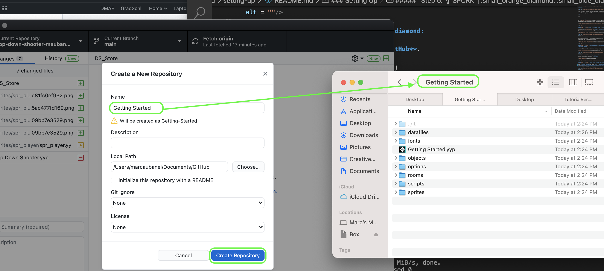

##### `Step 8.`\|`SPCRK`| :small_orange_diamond: :small_blue_diamond: :small_blue_diamond: :small_blue_diamond:

When you see them there has to be a `.git` hidden folder in the **same** directory as the project file (in my case **Space-Rocks.yyp**).

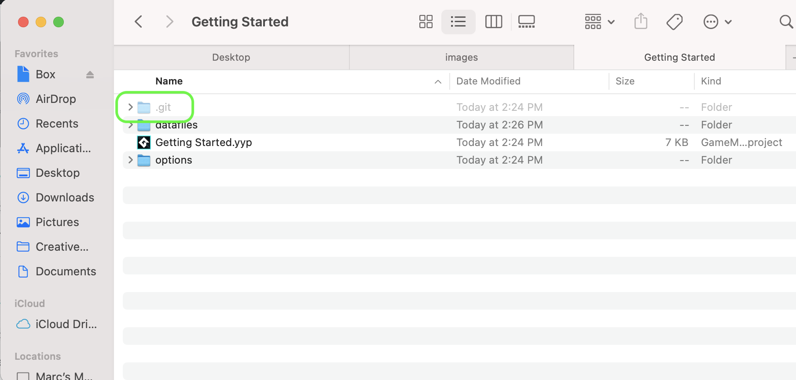

##### `Step 9.`\|`SPCRK`| :small_orange_diamond: :small_blue_diamond: :small_blue_diamond: :small_blue_diamond: :small_blue_diamond:

Press **Repository | Open in Terminal** on mac and **Repository | Open in ???** on PC.

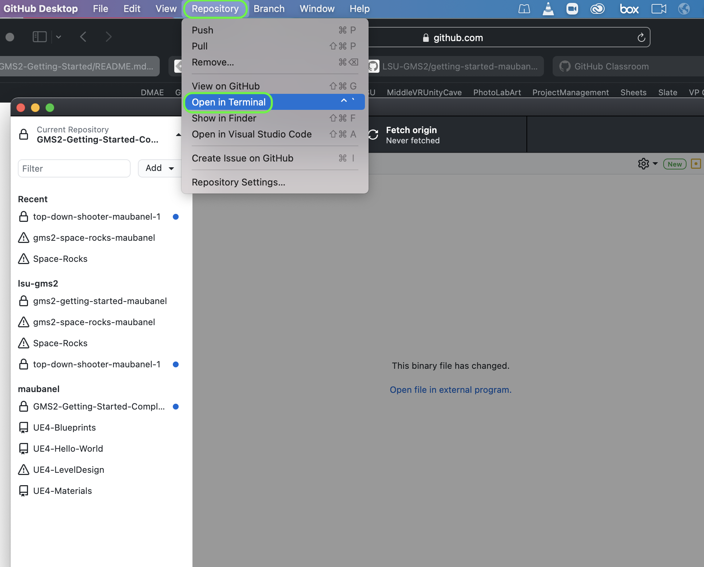

Now the only way we know that it works properly is to turn on the ability to see hidden files and folders.  Go to [Microsoft Resources](https://support.microsoft.com/en-us/windows/show-hidden-files-0320fe58-0117-fd59-6851-9b7f9840fdb2) for windows 10 instructions for turning on hidden files and folders.  Read this [article](https://www.macworld.co.uk/how-to/show-hidden-files-mac-3520878/) for instructions on the mac.

##### `Step 10.`\|`SPCRK`| :large_blue_diamond:

You now need to connect this new repository to the one you created in the second step in this walk through.  Copy and paste the line that includes `git remote add origin`... and press enter.

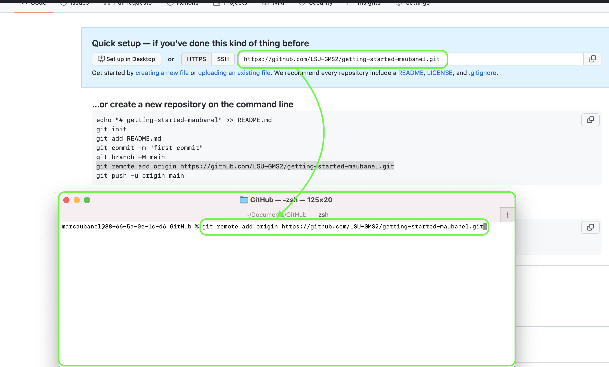

##### `Step 11.`\|`SPCRK`| :large_blue_diamond: :small_blue_diamond: 

Now type `git push -u origin main` to push your work to **GitHub**.  The project is now set up and you will be able to use **GitHub** desktop without command line for the rest of the project.

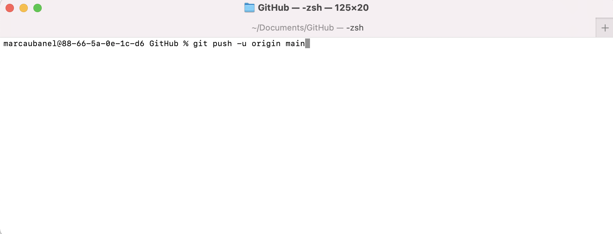

| `gms2.setting-up`\|`THE END`| 
| :--- |
| **That's All Folks!** That's it for setting up getting started. |

___

<!--  -->

