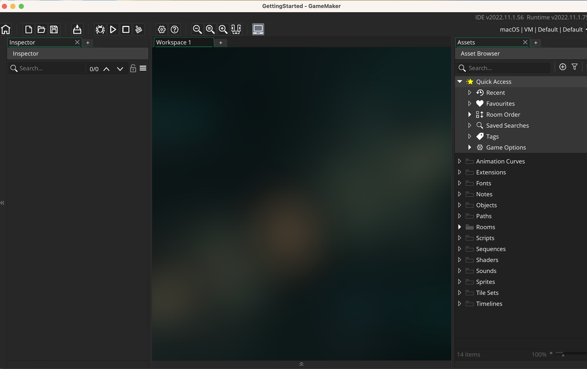

### Setting Up

[home](../README.md#user-content-gamemaker-studio-2-getting-started) • [next](../positioning-text/README.md#user-content-gms2-positioning-text)

This tutorial is intended for those wanting an introduction to <i>GameMaker Studio 2</i> using their scrpting language <i>GML</i>. This assumes no prior knowledge of the software or scripting. This walk through looks various concepts.

 

---

##### `Step 1.`\|`ITA`|:small_blue_diamond:
*Run* **GameMaker Studio 2** to launch the software.  Login with the user name you created.<kbd> </kbd>

##### `Step 2.`\|`FHIU`|:small_blue_diamond: :small_blue_diamond: 

If this is the first time you have run the game you may have to install the Runtime Modules. Feel free to select **Required Only** and press the <kbd>OK</kbd> button.

##### `Step 3.`\|`ITA`|:small_blue_diamond: :small_blue_diamond: :small_blue_diamond:

We will start a new project (or load up an existing one if we are continuing work). Press the <kbd>New</kbd> button to create a new project. Now we will start with a **Blank** project so press the <kbd>New Blank</kbd> button.

##### `Step 4.`\|`ITA`|:small_blue_diamond: :small_blue_diamond: :small_blue_diamond: :small_blue_diamond:

Enter the project name `GettingStarted`. Now you will select a directory and a name for the project.  I created a **GameMaker** directory in my **Documents Folder**. Press the <kbd>Let's Go</kbd> button to run the game.

##### `Step 5.`\|`ITA`| :small_orange_diamond:

This will take you to an empty project window in the main game editor.

##### `Step 6.`\|`ITA`| :small_orange_diamond: :small_blue_diamond:

Now the folder that holds the project is named with the same name as the project in the folder you selected prior to this step. Never edit the content of this folder.  Only add and delete files from the game interface.  You run the risk of permanently damaging your project and having to start over again.

##### `Step 7.`\|`ITA`| :small_orange_diamond: :small_blue_diamond: :small_blue_diamond:
The **GameMaker** folder will contain a `.yyp` file which is the project file.  This is just a text file and the actual contents it needs are in the folders.  **Do Not** rename, delete or add any files through the finder/explorer/operating system.  **Do Not** rename the project file through finder/explorer/operating system. All changes need to be made in the editor. 

___

<!--  -->

| [home](../README.md#user-content-gamemaker-studio-2-getting-started) | [next](../positioning-text/README.md#user-content-gms2-positioning-tex)|
|---|---|